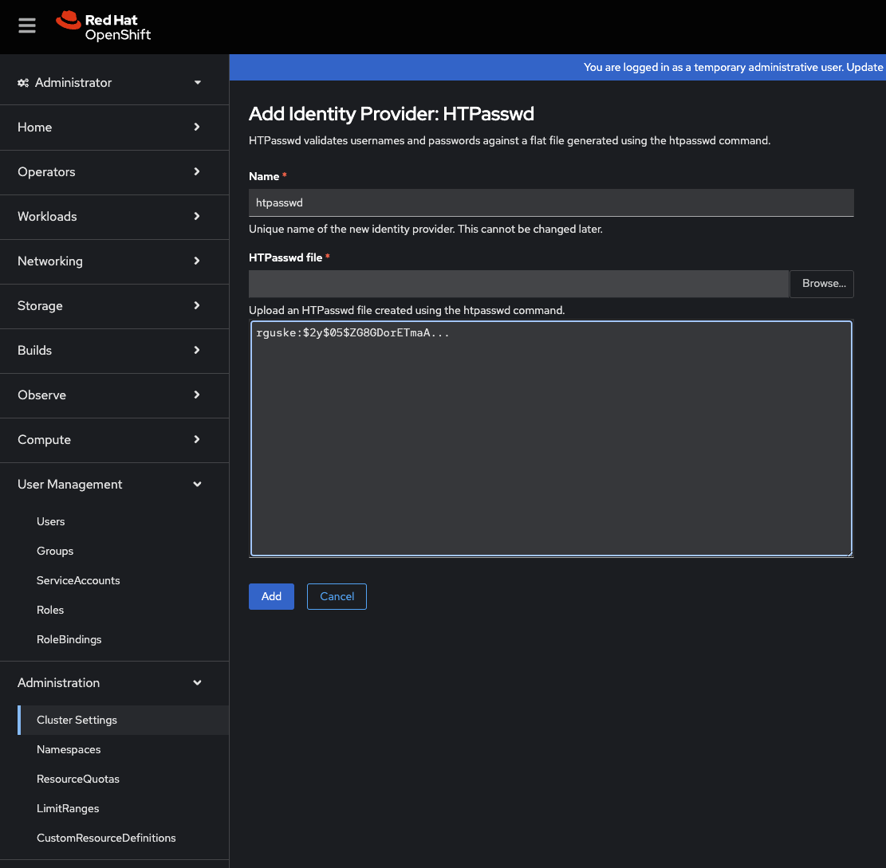
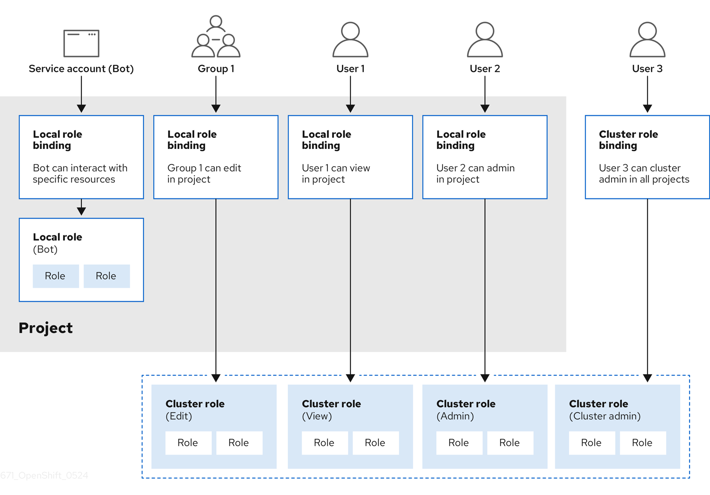
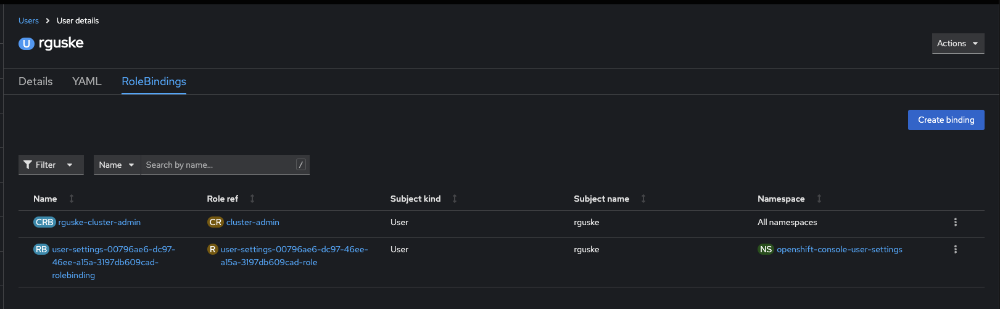
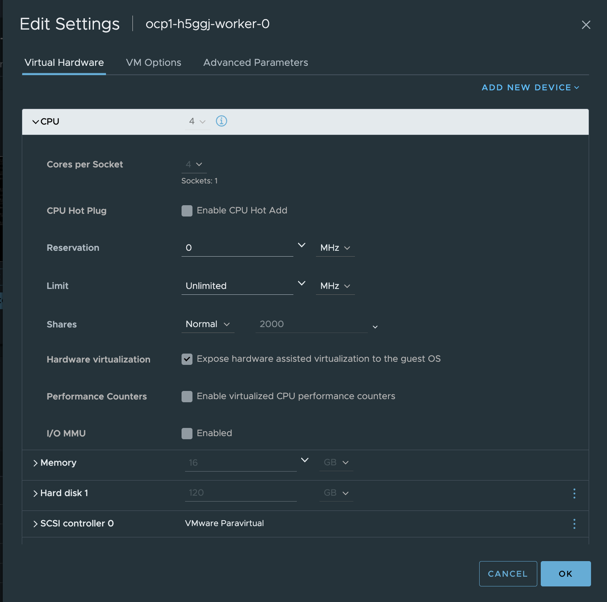
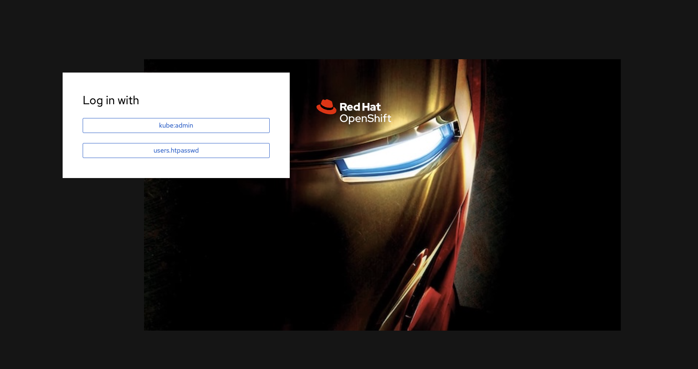

# Red Hat OpenShift Day-2 Operations

⚠️ WIP

- [Red Hat OpenShift Day-2 Operations](#red-hat-openshift-day-2-operations)
  - [OpenShift Identity Providers](#openshift-identity-providers)
    - [Configure `htpasswd`](#configure-htpasswd)
      - [Updating User](#updating-user)
      - [Configure RBAC Permissions](#configure-rbac-permissions)
    - [Configuring LDAP](#configuring-ldap)
      - [Obtain the certificate from a Windows Server](#obtain-the-certificate-from-a-windows-server)
      - [Validations](#validations)
      - [Creating the CR](#creating-the-cr)
  - [Node Configurations](#node-configurations)
    - [NTP using Chrony](#ntp-using-chrony)
    - [Make a Control-Plane Node `scheduable`](#make-a-control-plane-node-scheduable)
  - [Troubleshooting](#troubleshooting)
    - [Gathering Logs](#gathering-logs)
  - [Nested Virtualization](#nested-virtualization)
  - [Replacing the default Ingress Certificate](#replacing-the-default-ingress-certificate)
  - [OpenShift Web Console Customizations](#openshift-web-console-customizations)
    - [Customizing the Web Console in OpenShift Container Platform](#customizing-the-web-console-in-openshift-container-platform)
    - [Customizing the Login/Provider Page](#customizing-the-loginprovider-page)
  - [Registry Authentication](#registry-authentication)
  - [Activate Internal Registry](#activate-internal-registry)
    - [Storage Configuration](#storage-configuration)
    - [Activate the Registry Route](#activate-the-registry-route)
    - [Accessing the Registry](#accessing-the-registry)
  - [Quick NFS Storage](#quick-nfs-storage)
    - [Install the NFS Server](#install-the-nfs-server)
    - [NFS CSI Driver](#nfs-csi-driver)
    - [OpenShift NFS Provisioner Template](#openshift-nfs-provisioner-template)
    - [Deploying a Test-workload](#deploying-a-test-workload)
  - [USB Client Passthrough](#usb-client-passthrough)
    - [Adjust the VM Configuration (specs)](#adjust-the-vm-configuration-specs)
    - [Identify USB Vendor and Product ID](#identify-usb-vendor-and-product-id)
    - [Connect to your VM using `virtctl`](#connect-to-your-vm-using-virtctl)
    - [Start redirecting the USB Device](#start-redirecting-the-usb-device)


## OpenShift Identity Providers

### Configure `htpasswd`

[Docs: Configuring an htpasswd identity provider](https://docs.redhat.com/en/documentation/openshift_container_platform/4.17/html/authentication_and_authorization/configuring-identity-providers#configuring-htpasswd-identity-provider)

Step 1: Create an htpasswd file to store the user and password information:

`htpasswd -c -B -b users.htpasswd rguske <password>`

Add a new user to the file:

`htpasswd -bB users.htpasswd rbohne 'r3dh4t1!'`

`htpasswd -bB users.htpasswd devuser 'r3dh4t1!'`

Remove an existing user:

`htpasswd -D users.htpasswd <username>`

Replacing an updated `users.htpasswd` file:

`oc create secret generic htpass-secret --from-file=htpasswd=users.htpasswd --dry-run=client -o yaml -n openshift-config | oc replace -f -`

Step 2: Create a Kubernetes secret:

`oc create secret generic htpass-secret-rguske --from-file=htpasswd=<path_to_rguske.htpasswd> -n openshift-config`

`oc create secret generic htpass-secret-devuser --from-file=htpasswd=<path_to_devuser.htpasswd> -n openshift-config`

This can also be done using the OpenShift User Interface:



#### Updating User

`oc get secret htpass-secret -ojsonpath={.data.htpasswd} -n openshift-config | base64 --decode > users.htpasswd`

#### Configure RBAC Permissions

[Docs: Using RBAC to define and apply permissions](https://docs.redhat.com/en/documentation/openshift_container_platform/4.17/html/authentication_and_authorization/using-rbac#authorization-overview_using-rbac)



Add cluster-wide admin priviledges to e.g. user rguske:

```yaml
kind: ClusterRoleBinding
apiVersion: rbac.authorization.k8s.io/v1
metadata:
  name: rguske-cluster-admin
subjects:
  - kind: User
    apiGroup: rbac.authorization.k8s.io
    name: rguske
roleRef:
  apiGroup: rbac.authorization.k8s.io
  kind: ClusterRole
  name: cluster-admin
```

Alternatively via the WebUi:



### Configuring LDAP

[Configuring an LDAP identity provider](https://docs.redhat.com/en/documentation/openshift_container_platform/4.18/html/authentication_and_authorization/configuring-identity-providers#identity-provider-overview_configuring-ldap-identity-provider)

To use the identity provider, you must define an OpenShift Container Platform Secret object that contains the bindPassword field.

```shell
oc create secret generic ldap-secret \
    --from-literal='r3dh4t1!' \
    -n openshift-config
```

Identity providers use OpenShift Container Platform ConfigMap objects in the openshift-config namespace to contain the certificate authority bundle. These are primarily used to contain certificate bundles needed by the identity provider.

```shell
oc create configmap ca-config-map \
    --from-file=ca.crt=/path/to/ca \
    -n openshift-config
```

There's also an option to skip the certificate verification:

```yaml
      insecure: true
```

#### Obtain the certificate from a Windows Server

Via MMC (Microsoft Management Console):
Open MMC:

Press `Win + R`, type `mmc`, press Enter.
Add the Certificates Snap-in:

In MMC, go to File > Add/Remove Snap-in.
Select Certificates, click Add.
Choose Computer account, then Local computer, click Finish.
Navigate to the Certificate:

Expand Certificates (Local Computer).
Look under:
Personal > Certificates for most service-related certs.
Web Hosting > Certificates for IIS SSL certs.
Export the Certificate:

Right-click the certificate > All Tasks > Export.
Use the Certificate Export Wizard.
Choose Yes, export the private key if needed (e.g., for backup or moving).
Choose format: .PFX (with private key), or .CER (public cert only).

#### Validations

Validate the bind user and the appropriate configuration using `ldapsearch`:

```shell
ldapsearch -x -H ldap://w2k19-dc.rguske.coe.muc.redhat.com -D sa-ldap-bind \
    -b "DC=rguske,DC=coe,DC=muc,DC=redhat,DC=com" \
    -W '(sAMAccountName=rguske)'
```

#### Creating the CR

Creating the LDAP CR:

The following custom resource (CR) shows the parameters and acceptable values for an LDAP identity provider.

```yaml
apiVersion: config.openshift.io/v1
kind: OAuth
metadata:
  name: cluster
spec:
  identityProviders:
  - name: ldapidp
    mappingMethod: claim
    type: LDAP
    ldap:
      attributes:
        id:
        - dn
        email:
        - mail
        name:
        - cn
        preferredUsername:
        - uid
      bindDN: "sa-ldap-bind"
      bindPassword:
        name: ldap-bind-password-qrzn9
#      ca:
#        name: ca-config-map
      insecure: true
      url: "ldap://w2k19-dc.rguske.coe.muc.redhat.com/DC=rguske,DC=coe,DC=muc,DC=redhat,DC=com?sAMAccountName"
```

## Node Configurations

### NTP using Chrony

[Docs - Configuring chrony time service](https://docs.redhat.com/en/documentation/openshift_container_platform/4.18/html/machine_configuration/machine-configs-configure#installation-special-config-chrony_machine-configs-configure)

> You can set the time server and related settings used by the chrony time service (chronyd) by modifying the contents of the `chrony.conf` file.

Create a Butane config including the contents of the `chrony.conf` file. For example, to configure chrony on worker nodes, create a `99-worker-chrony.bu` file.

```yaml
tee 99-worker-chrony.bu > /dev/null <<'EOF'
variant: openshift
version: 4.18.0
metadata:
  name: 99-worker-chrony
  labels:
    machineconfiguration.openshift.io/role: worker
storage:
  files:
  - path: /etc/chrony.conf
    mode: 0644
    overwrite: true
    contents:
      inline: |
        server 10.10.42.20 iburst
        driftfile /var/lib/chrony/drift
        makestep 1.0 3
        rtcsync
        logdir /var/log/chrony
EOF
```

Use Butane (`brew install butane`) to generate a MachineConfig object file, 99-worker-chrony.yaml, containing the configuration to be delivered to the nodes:

`butane 99-worker-chrony.bu -o 99-worker-chrony.yaml`

Apply the config: `oc apply -f 99-worker-chrony.yaml`

Alternatively to `butane`:

```code
chronybase64=$(cat << EOF | base64 -w 0
server 10.10.42.20 iburst
driftfile /var/lib/chrony/drift
makestep 1.0 3
rtcsync
logdir /var/log/chrony
EOF
)
```

```yaml
oc apply -f - << EOF
apiVersion: machineconfiguration.openshift.io/v1
kind: MachineConfig
metadata:
  labels:
    machineconfiguration.openshift.io/role: worker
  name: 50-worker-chrony
spec:
  config:
    ignition:
      version: 2.2.0
    storage:
      files:
      - contents:
          source: data:text/plain;charset=utf-8;base64,${chronybase64}
        filesystem: root
        mode: 0644
        path: /etc/chrony.conf
EOF
```

### Make a Control-Plane Node `scheduable`

Red Hat KB6148012 - [How to schedule pod on master node where scheduling is disabled?](https://access.redhat.com/solutions/6148012)

```code
oc get scheduler cluster -oyaml

apiVersion: config.openshift.io/v1
kind: Scheduler
metadata:
  creationTimestamp: "2025-01-28T15:20:20Z"
  generation: 1
  name: cluster
  resourceVersion: "542"
  uid: 59f6fef1-e88a-484a-8e3c-fa38e6e300b3
spec:
  mastersSchedulable: false
  policy:
    name: ""
status: {}
```

Edit the `scheduler` CR and configure the spec: `mastersSchedulable: true`

```code
oc get nodes
NAME                  STATUS   ROLES                         AGE     VERSION
ocp1-h5ggj-master-0   Ready    control-plane,master,worker   2d19h   v1.30.6
ocp1-h5ggj-master-1   Ready    control-plane,master,worker   2d19h   v1.30.6
ocp1-h5ggj-master-2   Ready    control-plane,master,worker   2d19h   v1.30.6
ocp1-h5ggj-worker-0   Ready    worker                        2d18h   v1.30.6
ocp1-h5ggj-worker-1   Ready    worker                        2d18h   v1.30.6
```

## Troubleshooting

### Gathering Logs

[Creating must-gather with more details for specific components in OCP 4
](https://access.redhat.com/solutions/5459251)

Data Collection Audit logs:

`oc adm must-gather -- /usr/bin/gather_audit_logs`

Default must-gather including the audit logs:

`oc adm must-gather -- '/usr/bin/gather && /usr/bin/gather_audit_logs'`

OCPV:

`oc adm must-gather --image-stream=openshift/must-gather --image=registry.redhat.io/container-native-virtualization/cnv-must-gather-rhel[8,9]:[operator_version]`

The [8,9] should be replaced based on the version of OCP 4.12 uses rhel8, and OCP 4.13 and later uses rhel9.
The [operator_version] tag should be in format v4.y.z.

Examples - 4.17: `oc adm must-gather --image-stream=openshift/must-gather --image=registry.redhat.io/container-native-virtualization/cnv-must-gather-rhel8:v4.17.4`

```code
oc adm must-gather \
 --image-stream=openshift/must-gather \
 --image=registry.redhat.io/container-native-virtualization/cnv-must-gather-rhel9:v4.17.4 \
 --image=registry.redhat.io/workload-availability/node-healthcheck-must-gather-rhel9:v0.9.0
```

[How to generate a sosreport within nodes without SSH in OCP 4](https://access.redhat.com/solutions/4387261)

```code
oc get nodes
NAME                  STATUS   ROLES                         AGE     VERSION
ocp1-h5ggj-master-0   Ready    control-plane,master,worker   2d19h   v1.30.6
ocp1-h5ggj-master-1   Ready    control-plane,master,worker   2d19h   v1.30.6
ocp1-h5ggj-master-2   Ready    control-plane,master,worker   2d19h   v1.30.6
ocp1-h5ggj-worker-0   Ready    worker                        2d18h   v1.30.6
ocp1-h5ggj-worker-1   Ready    worker                        2d18h   v1.30.6
```

Then, create a debug session with oc debug node/<node name> (in this example oc debug node/node-1). The debug session will spawn a pod using the tools image from the release (which doesn't contain sos):

```code
oc debug node/ocp1-h5ggj-master-0
```

```code
chroot /host bash
[root@ocp1-h5ggj-master-0 /]#  cat /etc/redhat-release
Red Hat Enterprise Linux CoreOS release 4.17
```

```code
$ toolbox

Trying to pull registry.redhat.io/rhel9/support-tools:latest...
Getting image source signatures
Checking if image destination supports signatures
Copying blob facf1e7dd3e0 done   |
Copying blob a0e56de801f5 done   |
Copying blob ec465ce79861 done   |
Copying blob cbea42b25984 done   |
Copying config a627accb68 done   |
Writing manifest to image destination
Storing signatures
a627accb682adb407580be0d7d707afbcb90abf2f407a0b0519bacafa15dd409
Spawning a container 'toolbox-root' with image 'registry.redhat.io/rhel9/support-tools'
Detected RUN label in the container image. Using that as the default...
ebf4dd2b82bf8ebeab55291c8ca195b61e13c9fc5d8dfb095f5fdcbcdabae2df
toolbox-root
Container started successfully. To exit, type 'exit'.
```

`sosreport -e openshift -k crio.all=on -k crio.logs=on  -k podman.all=on -k podman.logs=on --all-logs`

## Nested Virtualization

[How to set the CPU model to Passthrough in OpenShift Virtualization?](https://access.redhat.com/solutions/7069612)

```yaml
oc create -f - <<EOF
apiVersion: kubevirt.io/v1
kind: VirtualMachine
metadata:
  annotations:
  labels:
    app: rhel9-pod-bridge
    kubevirt.io/dynamic-credentials-support: "true"
  name: rhel9-pod-bridge
spec:
  dataVolumeTemplates:
    - apiVersion: cdi.kubevirt.io/v1beta1
      kind: DataVolume
      metadata:
        name: rhel9-pod-bridge
      spec:
        sourceRef:
          kind: DataSource
          name: rhel9
          namespace: openshift-virtualization-os-images
        storage:
          accessModes:
            - ReadWriteMany
          storageClassName: thin-csi
          resources:
            requests:
              storage: 30Gi
  running: false
  template:
    metadata:
      annotations:
        vm.kubevirt.io/flavor: tiny
        vm.kubevirt.io/os: rhel9
        vm.kubevirt.io/workload: server
        kubevirt.io/allow-pod-bridge-network-live-migration: ""
      labels:
        kubevirt.io/domain: rhel9-pod-bridge
        kubevirt.io/size: tiny
    spec:
      domain:
        cpu:
          model: host-passthrough
          cores: 1
          sockets: 1
          threads: 1
        devices:
          disks:
            - disk:
                bus: virtio
              name: rootdisk
            - disk:
                bus: virtio
              name: cloudinitdisk
          interfaces:
            - bridge: {}
              name: default
        machine:
          type: pc-q35-rhel9.2.0
        memory:
          guest: 1.5Gi
      networks:
        - name: default
          pod: {}
      terminationGracePeriodSeconds: 180
      volumes:
        - dataVolume:
            name: rhel9-pod-bridge
          name: rootdisk
        - cloudInitNoCloud:
            userData: |-
              #cloud-config
              user: cloud-user
              password: redhat
              chpasswd: { expire: False }
          name: cloudinitdisk
EOF
```

Other sources:

[OpenShift Virtualization reports no nodes are available, cannot start VMs](https://access.redhat.com/solutions/5106121)

[Nested virtualization in OpenShift Virtualization](https://access.redhat.com/solutions/6692341)

Enable features on vSphere:



## Replacing the default Ingress Certificate

Prerequisites:

- You must have a wildcard certificate for the fully qualified .apps subdomain and its corresponding private key. Each should be in a separate PEM format file.
- The private key must be unencrypted. If your key is encrypted, decrypt it before importing it into OpenShift Container Platform.
- The certificate must include the subjectAltName extension showing *.apps.<clustername>.<domain>.
- The certificate file can contain one or more certificates in a chain. The wildcard certificate must be the first certificate in the file. It can then be followed with any intermediate certificates, and the file should end with the root CA certificate.
- Copy the root CA certificate into an additional PEM format file.
- Verify that all certificates which include -----END CERTIFICATE----- also end with one carriage return after that line.

Create a config map that includes only the root CA certificate used to sign the wildcard certificate:

```yaml
oc apply -f - <<EOF
apiVersion: v1
kind: ConfigMap
metadata:
  name: user-ca-bundle
  namespace: openshift-config
data:
  ca-bundle.crt: |
    # MyPrivateCA (root.crt)
    -----BEGIN CERTIFICATE-----
   zzzzz
    -----END CERTIFICATE-----
EOF
```

Update the cluster-wide proxy configuration with the newly created config map:

```code
oc patch proxy/cluster \
     --type=merge \
     --patch='{"spec":{"trustedCA":{"name":"user-ca-bundle"}}}'
```

Create a secret that contains the wildcard certificate chain and key:

```code
oc create secret tls ocp1-wildcard-cert \
     --cert='/Users/rguske/Downloads/ocp1.rguske/chain.crt' \
     --key='/Users/rguske/Downloads/ocp1.rguske/key.key' \
     -n openshift-ingress
```

Update the Ingress Controller configuration with the newly created secret:

// Replace the secret name

```code
oc patch ingresscontroller.operator default \
     --type=merge -p \
     '{"spec":{"defaultCertificate": {"name": "ocp1-wildcard-cert"}}}' \
     -n openshift-ingress-operator
```

Watch the ClusterOperator (`co`) for the status update.

## OpenShift Web Console Customizations

### Customizing the Web Console in OpenShift Container Platform

[Docs - Customizing the web console in OpenShift Container Platform](https://docs.openshift.com/container-platform/4.17/web_console/customizing-the-web-console.html)

```code
oc create configmap console-custom-logo --from-file /path/to/console-custom-logo.png -n openshift-config
```

oc create configmap console-custom-logo --from-file '/Users/rguske/Documents/ironman.jpg' -n openshift-config

Edit the web console’s Operator configuration to include customLogoFile and customProductName:

`oc edit consoles.operator.openshift.io cluster`

```yaml
apiVersion: operator.openshift.io/v1
kind: Console
metadata:
  name: cluster
spec:
  customization:
    customLogoFile:
      key: ironman.jpg
      name: console-custom-logo
    customProductName: My Console
```

Once the Operator configuration is updated, it will sync the custom logo config map into the console namespace, mount it to the console pod, and redeploy.

Validate: `oc get clusteroperator console`

### Customizing the Login/Provider Page

[Docs - Customizing the login page](https://docs.openshift.com/container-platform/4.17/web_console/customizing-the-web-console.html)

Run the following commands to create templates you can modify:

`oc adm create-login-template > login.html`

Alternatively, adjust the existing `login.html` and or `provider.html`.

Export the existing `login.html` and `provider.html`:

`POD=$(oc get pods -n openshift-authentication -o name | head -n 1)`

`oc exec -n openshift-authentication "$POD" -- cat /var/config/system/secrets/v4-0-config-system-ocp-branding-template/login.html > login.html`

`oc exec -n openshift-authentication "$POD" -- cat /var/config/system/secrets/v4-0-config-system-ocp-branding-template/providers.html > providers.html`

Choose an image ewhich you'd like to use for the replacement. Encode the the image into `base64`. [Base64 Guru](https://base64.guru/converter/encode/image) helps.

Replace the base64 value in the `login.html`. Search for `background-image:url(data:image/`, pay attention to the file format (png, svg, jpg), adjust it if necessary and replace the base64 value of the image.

Create the secrets:

```code
oc -n openshift-config get secret
NAME                                      TYPE                             DATA   AGE
etcd-client                               kubernetes.io/tls                2      8d
htpasswd-dm9mt                            Opaque                           1      6d1h
initial-service-account-private-key       Opaque                           1      8d
pull-secret                               kubernetes.io/dockerconfigjson   1      8d
webhook-authentication-integrated-oauth   Opaque                           1      8d
```

`oc create secret generic login-template --from-file=login.html -n openshift-config`

`oc create secret generic providers-template --from-file=providers.html -n openshift-config`

Edit the `oauth` CR:

`oc edit oauths cluster`

```yaml
apiVersion: config.openshift.io/v1
kind: OAuth
metadata:
  name: cluster
# ...
spec:
  templates:
    error:
        name: error-template
    login:
        name: login-template
    providerSelection:
        name: providers-template
```

After editing the CR, the pods within the `openshift-authentication` namespace will be redeployed.

```code
oc -n openshift-authentication get pods -w
NAME                              READY   STATUS    RESTARTS   AGE
oauth-openshift-8c7859b9f-fwsnl   1/1     Running   0          6m55s
oauth-openshift-8c7859b9f-kp8rw   1/1     Running   0          7m53s
oauth-openshift-8c7859b9f-qw7wl   1/1     Running   0          7m25s
oauth-openshift-8c7859b9f-kp8rw   1/1     Terminating   0          8m42s
oauth-openshift-664fbb9d49-r5bzk   0/1     Pending       0          0s
oauth-openshift-664fbb9d49-r5bzk   0/1     Pending       0          0s
oauth-openshift-8c7859b9f-kp8rw    0/1     Terminating   0          9m8s
oauth-openshift-664fbb9d49-r5bzk   0/1     Pending       0          26s
oauth-openshift-664fbb9d49-r5bzk   0/1     Pending       0          26s
oauth-openshift-664fbb9d49-r5bzk   0/1     ContainerCreating   0          26s
oauth-openshift-8c7859b9f-kp8rw    0/1     Terminating         0          9m8s
oauth-openshift-8c7859b9f-kp8rw    0/1     Terminating         0          9m8s
oauth-openshift-664fbb9d49-r5bzk   0/1     ContainerCreating   0          27s
oauth-openshift-664fbb9d49-r5bzk   0/1     Running             0          27s
oauth-openshift-664fbb9d49-r5bzk   1/1     Running             0          28s
```



## Registry Authentication

```code
oc create secret docker-registry docker-hub \
    --docker-server=docker.io \
    --docker-username= \
    --docker-password='' \
    --docker-email=''
```

oc secrets link default docker-hub --for=pull

## Activate Internal Registry

[Docs - Changing the image registry’s management state](https://docs.redhat.com/en/documentation/openshift_container_platform/4.18/html/registry/setting-up-and-configuring-the-registry#registry-change-management-state_configuring-registry-storage-vsphere)

You need to first activate the Internal Registry by changing its state to `managed`. To start the image registry, you must change the Image Registry Operator configuration’s managementState from `Removed` to `Managed`.

```code
oc patch configs.imageregistry.operator.openshift.io cluster --type merge --patch '{"spec":{"managementState":"Managed"}}'
```

Default:

```code
oc get configs.imageregistry.operator.openshift.io cluster
NAME      AGE
cluster   36d

oc get configs.imageregistry.operator.openshift.io cluster -oyaml | grep managementState
  managementState: Removed

oc patch configs.imageregistry.operator.openshift.io cluster --type merge --patch '{"spec":{"managementState":"Managed"}}'
config.imageregistry.operator.openshift.io/cluster patched

oc get configs.imageregistry.operator.openshift.io cluster -oyaml | grep managementState
  managementState: Managed
```

### Storage Configuration

[Docs -  Image registry storage configuration](https://docs.redhat.com/en/documentation/openshift_container_platform/4.18/html/registry/setting-up-and-configuring-the-registry#installation-registry-storage-config_configuring-registry-storage-vsphere)

Verify that you do not have a registry pod:

```code
oc get pod -n openshift-image-registry -l docker-registry=default
```

Edit the cluster operator:

```code
oc edit configs.imageregistry.operator.openshift.io
```

Adjust the storage section accordingly. Leave the claim field blank to allow the automatic creation of an image-registry-storage persistent volume claim (PVC).

```yaml
[...]
storage:
    pvc:
      claim:
[...]
```

### Activate the Registry Route

[Docs - Enable the Image Registry default route with the Custom Resource Definition](https://docs.redhat.com/en/documentation/openshift_container_platform/4.18/html/registry/configuring-registry-operator#registry-operator-default-crd_configuring-registry-operator)

In OpenShift Container Platform, the Registry Operator controls the OpenShift image registry feature. The Operator is defined by the `configs.imageregistry.operator.openshift.io` Custom Resource Definition (CRD).

If you need to automatically enable the Image Registry default route, patch the Image Registry Operator CRD.

```code
oc patch configs.imageregistry.operator.openshift.io/cluster --type merge -p '{"spec":{"defaultRoute":true}}'
```

```code
oc -n openshift-image-registry get route
NAME            HOST/PORT                                                        PATH   SERVICES         PORT    TERMINATION   WILDCARD
default-route   default-route-openshift-image-registry.apps.ocp-mk1.jarvis.lab          image-registry   <all>   reencrypt     None
```

### Accessing the Registry

[Docs - Exposing a default registry manually](https://docs.redhat.com/en/documentation/openshift_container_platform/4.18/html/registry/securing-exposing-registry#registry-exposing-default-registry-manually_securing-exposing-registry)

```code
podman login -u rguske -p $(oc whoami -t) --tls-verify=false $HOST
Login Succeeded!
```

With Certificate:

```code
oc extract secret/$(oc get ingresscontroller -n openshift-ingress-operator default -o json | jq '.spec.defaultCertificate.name // "router-certs-default"' -r) -n openshift-ingress --confirm
```

```code
sudo mv tls.crt /etc/pki/ca-trust/source/anchors/
```

```code
sudo update-ca-trust enable
```

Create a Secret using the exracted certificates:

```code
oc create secret tls public-route-tls \
    -n openshift-image-registry \
    --cert=/Users/rguske/Downloads/tls.crt \
    --key=/Users/rguske/Downloads/tls.key
```

Configure the Operator using `oc edit configs.imageregistry.operator.openshift.io/cluster`

```yaml
  routes:
    - name: public-routes
      hostname: default-route-openshift-image-registry.apps.ocp-mk1.jarvis.lab
      secretName: public-route-tls
```


## Quick NFS Storage

### Install the NFS Server

In can be handy to have a NFS backend storage for an OpenShift cluster available quickly. The following instructions guides you through the installation of a NFS server installed on a RHEL bastion host.

Install the NFS package and activate the service:

```code
dnf install nfs-utils -y
systemctl enable nfs-server.service
systemctl start nfs-server.service
systemctl status nfs-server.service
```

Create the directory in which the Persistent Volumes will be stored in:

```code
mkdir /srv/nfs-storage-pv-user-pvs
chmod g+w /srv/nfs-storage-pv-user-pvs
```

Configure the folder as well as the network CIDR for the systems which are accessing the NFS server:

```code
vi /etc/exports
/srv/nfs-storage-pv-user-pvs  10.198.15.0/24(rw,sync,no_root_squash)
systemctl restart nfs-server
exportfs -arv
exportfs -s
```

Configure the firewall on the RHEL accordingly:

```
firewall-cmd --permanent --add-service=nfs
firewall-cmd --permanent --add-service=rpc-bind
firewall-cmd --permanent --add-service=mountd
firewall-cmd --reload
```

### NFS CSI Driver

```code
# Add Helm repo
helm repo add csi-driver-nfs https://raw.githubusercontent.com/kubernetes-csi/csi-driver-nfs/master/charts

# List versions
helm search repo -l csi-driver-nfs
```

Install the NFS provisioner:

```code
helm install csi-driver-nfs csi-driver-nfs/csi-driver-nfs --version 4.11.0 \
  --create-namespace \
  --namespace csi-driver-nfs \
  --set controller.runOnControlPlane=true \
  --set controller.replicas=2 \
  --set controller.strategyType=RollingUpdate \
  --set externalSnapshotter.enabled=true \
  --set externalSnapshotter.customResourceDefinitions.enabled=false
```

For a SNO setup:

```code
helm install csi-driver-nfs csi-driver-nfs/csi-driver-nfs --version 4.11.0 \
  --create-namespace \
  --namespace csi-driver-nfs \
  --set controller.runOnControlPlane=true \
  --set controller.strategyType=RollingUpdate \
  --set externalSnapshotter.enabled=true \
  --set externalSnapshotter.customResourceDefinitions.enabled=false
```

Grant additional permissions to the ServiceAccounts:

`oc adm policy add-scc-to-user privileged -z csi-nfs-node-sa -n csi-driver-nfs`

`oc adm policy add-scc-to-user privileged -z csi-nfs-controller-sa -n csi-driver-nfs`

Create a StorageClass:

`oc apply -f 

```yaml
apiVersion: storage.k8s.io/v1
kind: StorageClass
metadata:
  name: nfs-csi
  annotations:
    storageclass.kubernetes.io/is-default-class: "true"
provisioner: nfs.csi.k8s.io
parameters:
  server: 10.10.42.20   ### NFS server's IP/FQDN
  share: /volume1/nfs_ds/ocp             ### NFS server's exported directory
  subDir: ${pvc.metadata.namespace}-${pvc.metadata.name}-${pv.metadata.name}  ### Folder/subdir name template
reclaimPolicy: Delete
volumeBindingMode: Immediate
allowVolumeExpansion: true
```

Create a SnapshotClass:

```yaml
---
apiVersion: snapshot.storage.k8s.io/v1
kind: VolumeSnapshotClass
deletionPolicy: Delete
driver: nfs.csi.k8s.io
metadata:
  name: csi-nfs-snapclass
```

Set the StorageClass to `default`:

`oc annotate storageclass/nfs-csi storageclass.kubernetes.io/is-default-class=true`

### OpenShift NFS Provisioner Template

We need a NFS provisioner in order to consume the NFS service. Create the following OpenShift template and make sure to adjust the IP address as well as the path to the NFS folder accordingly at the end of the file:

Example:

```yaml
- name: NFS_SERVER
  required: true
  value: xxx.xxx.xxx.xxx ## IP of the host which runs the NFS server
- name: NFS_PATH
  required: true
  value: /srv/nfs-storage-pv-user-pvs ## folder which was configured on the NFS server
```

Create the template:

```yaml
tee nfs-provisioner-template.yaml > /dev/null <<'EOF'
apiVersion: template.openshift.io/v1
kind: Template
labels:
  template: nfs-client-provisioner
message: 'NFS storage class ${STORAGE_CLASS} created.'
metadata:
  annotations:
    description: nfs-client-provisioner
    openshift.io/display-name: nfs-client-provisioner
    openshift.io/provider-display-name: Tiger Team
    tags: infra,nfs
    template.openshift.io/documentation-url: nfs-client-provisioner
    template.openshift.io/long-description: nfs-client-provisioner
    version: 0.0.1
  name: nfs-client-provisioner
objects:
- kind: Namespace
  apiVersion: v1
  metadata:
    name: ${TARGET_NAMESPACE}
- kind: ServiceAccount
  apiVersion: v1
  metadata:
    name: nfs-client-provisioner
    namespace: ${TARGET_NAMESPACE}
- kind: ClusterRole
  apiVersion: rbac.authorization.k8s.io/v1
  metadata:
    name: nfs-client-provisioner-runner
  rules:
    - apiGroups: [""]
      resources: ["persistentvolumes"]
      verbs: ["get", "list", "watch", "create", "delete"]
    - apiGroups: [""]
      resources: ["persistentvolumeclaims"]
      verbs: ["get", "list", "watch", "update"]
    - apiGroups: ["storage.k8s.io"]
      resources: ["storageclasses"]
      verbs: ["get", "list", "watch"]
    - apiGroups: [""]
      resources: ["events"]
      verbs: ["create", "update", "patch"]

- kind: ClusterRoleBinding
  apiVersion: rbac.authorization.k8s.io/v1
  metadata:
    name: run-nfs-client-provisioner
  subjects:
    - kind: ServiceAccount
      name: nfs-client-provisioner
      namespace: ${TARGET_NAMESPACE}
  roleRef:
    kind: ClusterRole
    name: nfs-client-provisioner-runner
    apiGroup: rbac.authorization.k8s.io

- kind: Role
  apiVersion: rbac.authorization.k8s.io/v1
  metadata:
    name: nfs-client-provisioner
    namespace: ${TARGET_NAMESPACE}
  rules:
    - apiGroups: [""]
      resources: ["endpoints"]
      verbs: ["get", "list", "watch", "create", "update", "patch"]
    - apiGroups: ["security.openshift.io"]
      resourceNames: ["hostmount-anyuid"]
      resources: ["securitycontextconstraints"]
      verbs: ["use"]

- kind: RoleBinding
  apiVersion: rbac.authorization.k8s.io/v1
  metadata:
    name: nfs-client-provisioner
    namespace: ${TARGET_NAMESPACE}
  subjects:
    - kind: ServiceAccount
      name: nfs-client-provisioner
  roleRef:
    kind: Role
    name: nfs-client-provisioner
    apiGroup: rbac.authorization.k8s.io

- kind: Deployment
  apiVersion: apps/v1
  metadata:
    name: nfs-client-provisioner
    namespace: ${TARGET_NAMESPACE}
  spec:
    replicas: 1
    selector:
      matchLabels:
        app: nfs-client-provisioner
    strategy:
      type: Recreate
    template:
      metadata:
        labels:
          app: nfs-client-provisioner
      spec:
        serviceAccountName: nfs-client-provisioner
        containers:
          - name: nfs-client-provisioner
            image: ${PROVISIONER_IMAGE}
            volumeMounts:
              - name: nfs-client-root
                mountPath: /persistentvolumes
            env:
              - name: PROVISIONER_NAME
                value: ${PROVISIONER_NAME}
              - name: NFS_SERVER
                value: ${NFS_SERVER}
              - name: NFS_PATH
                value: ${NFS_PATH}
        volumes:
          - name: nfs-client-root
            nfs:
              server: ${NFS_SERVER}
              path: ${NFS_PATH}

- apiVersion: storage.k8s.io/v1
  kind: StorageClass
  metadata:
    name: managed-nfs-storage
    annotations:
      storageclass.kubernetes.io/is-default-class: "true"
  provisioner: ${PROVISIONER_NAME}
  parameters:
    archiveOnDelete: "false"

parameters:
- description: Target namespace where nfs-client-provisioner will run.
  displayName: Target namespace
  name: TARGET_NAMESPACE
  required: true
  value: openshift-nfs-provisioner
- name: NFS_SERVER
  required: true
  value: xxx.xxx.xxx.xxx ## IP of the host which runs the NFS server
- name: NFS_PATH
  required: true
  value: /srv/nfs-storage-pv-user-pvs ## folder which was configured on the NFS server
- name: PROVISIONER_IMAGE
  value: registry.k8s.io/sig-storage/nfs-subdir-external-provisioner:v4.0.2
- name: PROVISIONER_NAME
  value: "nfs-client-provisioner"
EOF
```

Deploy the template: `oc process -f nfs-provisioner-template.yaml | oc apply -f -`

### Deploying a Test-workload

```yaml
oc -n test1 create -f - <<EOF
kind: Deployment
apiVersion: apps/v1
metadata:
  name: ubi9
spec:
  replicas: 1
  selector:
    matchLabels:
      app: ubi9
  template:
    metadata:
      creationTimestamp: null
      labels:
        app: ubi9
    spec:
      storageClassName: managed-nfs-storage
      volumes:
        - name: pvc
          persistentVolumeClaim:
            claimName: pvc
      containers:
        - name: ubi
          image: 'registry.access.redhat.com/ubi9/ubi-micro:latest'
          volumeMounts:
            - name: pvc
              mountPath: /pvc
          command:
            - /bin/sh
            - '-c'
            - |
              sleep infinity
EOF
```

Create the first `PersistentVolumeClaim` either via the OpenShift Webconsole or via `oc`:

```yaml
oc -n test create -f - <<EOF
kind: PersistentVolumeClaim
apiVersion: v1
metadata:
  name: pvc
spec:
  accessModes:
    - ReadWriteOnce
  resources:
    requests:
      storage: 5Gi
  storageClassName: managed-nfs-storage
  volumeMode: Filesystem
  accessModes:
    - ReadWriteOnce
  capacity:
    storage: 5Gi
EOF
```

## USB Client Passthrough

Not supported in Red Hat OpenShift Virtualization!

- [Kubevirt - Client Passthrough](https://kubevirt.io/user-guide/compute/client_passthrough/#client-passthrough)

From the official docs:

Support for redirection of client's USB device was introduced in release v0.44. This feature is not enabled by default. To enable it, add an empty clientPassthrough under devices, as such:

### Adjust the VM Configuration (specs)

```yaml
spec:
  domain:
    devices:
      clientPassthrough: {}
```

> There are two ways of redirecting the same USB devices: Either using its device's vendor and product information or the actual bus and device address information. In Linux, you can gather this info with lsusb, a redacted example below:

### Identify USB Vendor and Product ID

Connect an USB device like e.g. an external CD-Rom device. I've connected it to my MacBook, installed `lsusb` via `brew` and checked for the Vendor ID and Product ID.

```shell
lsusb
[...]
Bus 002 Device 001: ID 0e8d:1806 MediaTek Inc. MT1806  Serial: R8RY6GAC60008Y
[...]
```

### Connect to your VM using `virtctl`

Connect to your VM running on OpenShift Virtualization.

```shell
virtctl console rguske-rhel9
Successfully connected to rguske-rhel9 console. The escape sequence is ^]

rguske-rhel9 login:

[cloud-user@rguske-rhel9 ~]$ lsusb
Bus 001 Device 001: ID 1d6b:0002 Linux Foundation 2.0 root hub
Bus 002 Device 001: ID 1d6b:0003 Linux Foundation 3.0 root hub
```

### Start redirecting the USB Device

On your local machine, install `virtctl` and the `usbredir`. I've installed both using `brew`.

```shell
sudo virtctl usbredir 0e8d:1806 rguske-rhel9

{"component":"portforward","level":"info","msg":"port_arg: '127.0.0.1:49275'","pos":"client.go:166","timestamp":"2025-03-26T10:19:43.292294Z"}
{"component":"portforward","level":"info","msg":"args: '[--device 0e8d:1806 --to 127.0.0.1:49275]'","pos":"client.go:167","timestamp":"2025-03-26T10:19:43.293541Z"}
{"component":"portforward","level":"info","msg":"Executing commandline: 'usbredirect [--device 0e8d:1806 --to 127.0.0.1:49275]'","pos":"client.go:168","timestamp":"2025-03-26T10:19:43.293591Z"}
{"component":"portforward","level":"info","msg":"Connected to usbredirect at 610.549083ms","pos":"client.go:132","timestamp":"2025-03-26T10:19:43.903058Z"}
```

The output will show the redirection to your Virtual Machine.

On your target VM, you'll notice:

```shell
[151999.488527] usb 1-1: new high-speed USB device number 9 using xhci_hcd
[152000.279607] usb 1-1: New USB device found, idVendor=0e8d, idProduct=1806, bcdDevice= 0.00
[152000.280126] usb 1-1: New USB device strings: Mfr=1, Product=2, SerialNumber=3
[152000.280490] usb 1-1: Product: MT1806
[152000.280786] usb 1-1: Manufacturer: MediaTek Inc
[152000.281075] usb 1-1: SerialNumber: R8RY6GAC60008Y
[152000.548218] usb-storage 1-1:1.0: USB Mass Storage device detected
[152000.551594] scsi host7: usb-storage 1-1:1.0
[152001.907628] scsi 7:0:0:0: CD-ROM            ASUS     SDRW-08D3S-U     F201 PQ: 0 ANSI: 0
[152002.595801] sr 7:0:0:0: [sr0] scsi3-mmc drive: 24x/24x writer dvd-ram cd/rw xa/form2 cdda tray
[152003.026401] sr 7:0:0:0: Attached scsi generic sg0 type 5
```

Using `lsusb` will show the connected device:

```shell
[cloud-user@rguske-rhel9 ~]$ lsusb
Bus 001 Device 001: ID 1d6b:0002 Linux Foundation 2.0 root hub
Bus 001 Device 009: ID 0e8d:1806 MediaTek Inc. Samsung SE-208 Slim Portable DVD Writer
Bus 002 Device 001: ID 1d6b:0003 Linux Foundation 3.0 root hub
```
