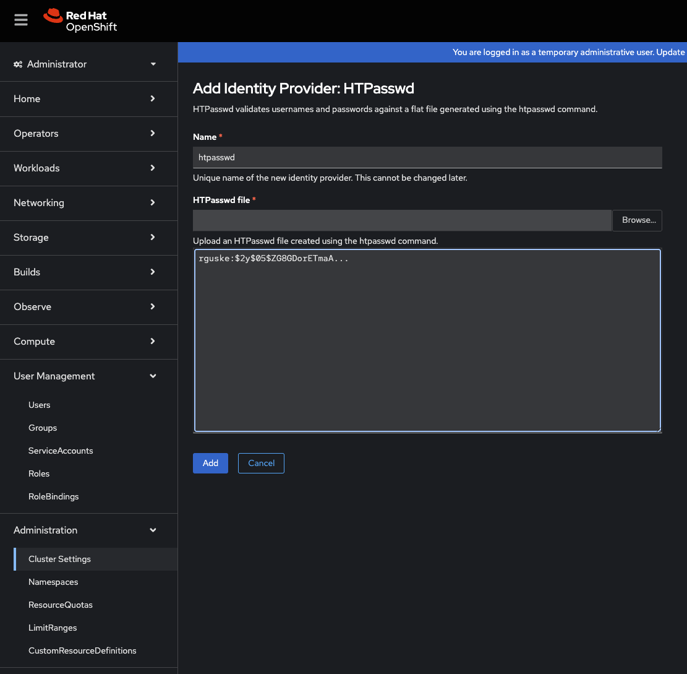
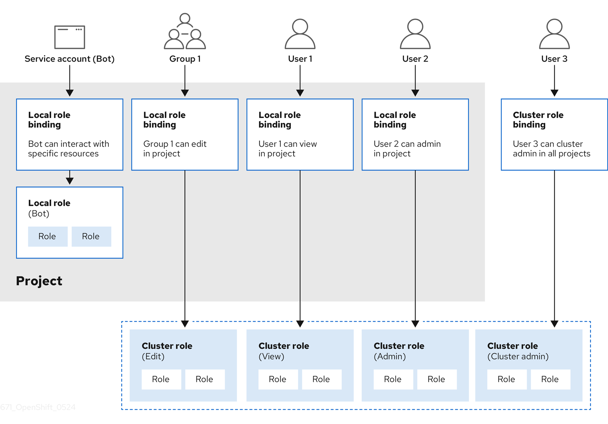
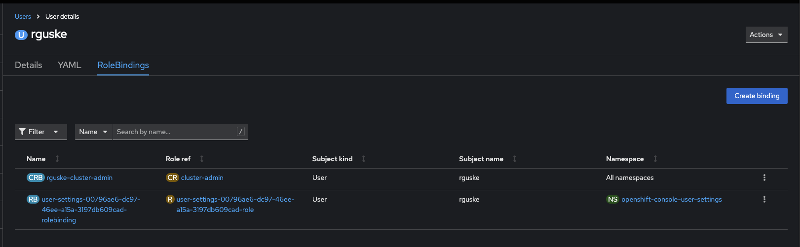
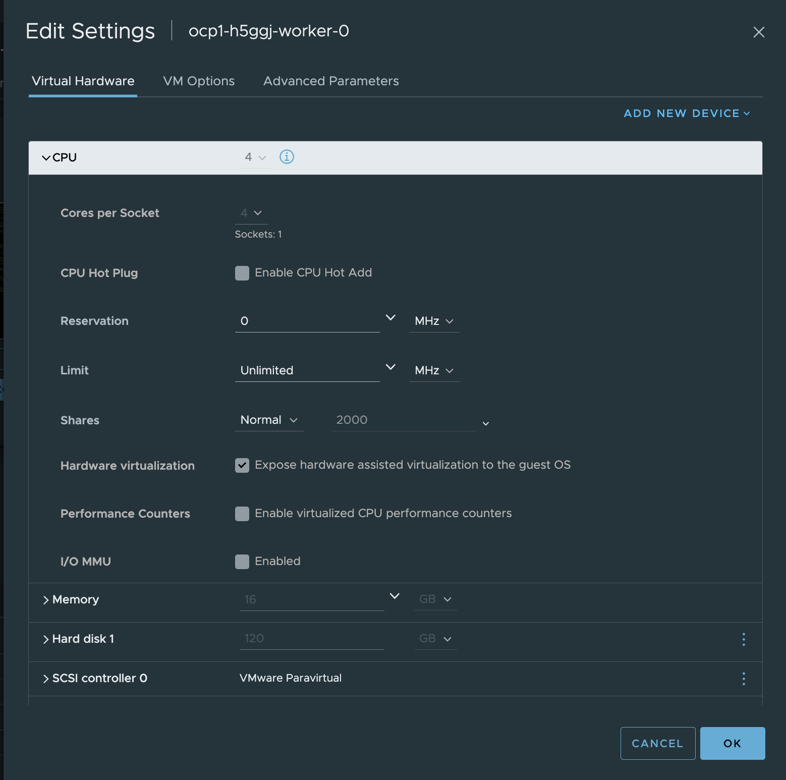
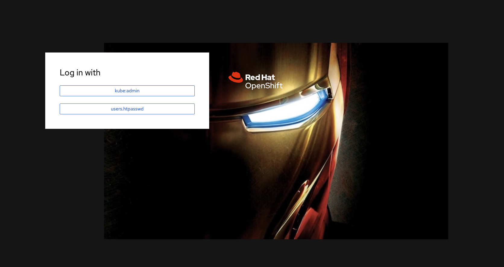
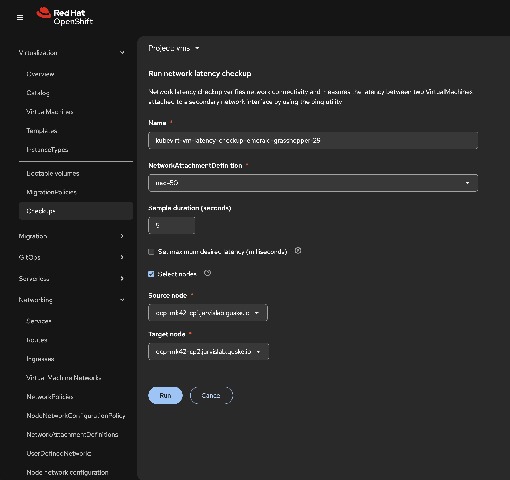
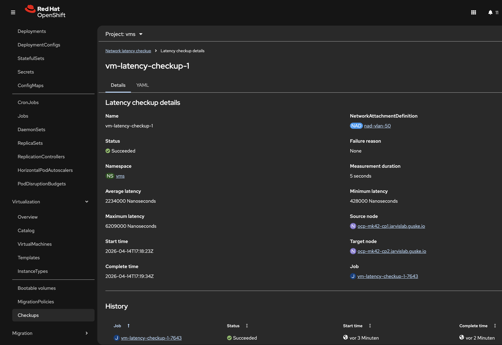

# Red Hat OpenShift Day-2 Operations

⚠️ WIP

- [Red Hat OpenShift Day-2 Operations](#red-hat-openshift-day-2-operations)
  - [OpenShift Identity Providers](#openshift-identity-providers)
    - [Configure `htpasswd`](#configure-htpasswd)
      - [Updating User](#updating-user)
      - [Configure RBAC Permissions](#configure-rbac-permissions)
    - [Configuring LDAP](#configuring-ldap)
      - [Obtain the certificate from a Windows Server](#obtain-the-certificate-from-a-windows-server)
      - [Validations](#validations)
      - [Creating the CR](#creating-the-cr)
  - [Node Configurations](#node-configurations)
    - [NTP using Chrony](#ntp-using-chrony)
    - [Make a Control-Plane Node `scheduable`](#make-a-control-plane-node-scheduable)
  - [Troubleshooting](#troubleshooting)
    - [Gathering Logs](#gathering-logs)
  - [Nested Virtualization](#nested-virtualization)
  - [Replacing the default Ingress Certificate](#replacing-the-default-ingress-certificate)
  - [OpenShift Web Console Customizations](#openshift-web-console-customizations)
    - [Customizing the Web Console in OpenShift Container Platform](#customizing-the-web-console-in-openshift-container-platform)
    - [Customizing the Login/Provider Page](#customizing-the-loginprovider-page)
  - [Registry Authentication](#registry-authentication)
  - [Activate Internal Registry](#activate-internal-registry)
    - [Storage Configuration](#storage-configuration)
    - [Activate the Registry Route](#activate-the-registry-route)
    - [Accessing the Registry](#accessing-the-registry)
  - [Quick NFS Storage](#quick-nfs-storage)
    - [Install the NFS Server](#install-the-nfs-server)
    - [NFS CSI Driver](#nfs-csi-driver)
    - [OpenShift NFS Provisioner Template](#openshift-nfs-provisioner-template)
    - [Deploying a Test-workload](#deploying-a-test-workload)
    - [Local Storage](#local-storage)
  - [USB Client Passthrough](#usb-client-passthrough)
    - [Adjust the VM Configuration (specs)](#adjust-the-vm-configuration-specs)
    - [Identify USB Vendor and Product ID](#identify-usb-vendor-and-product-id)
    - [Connect to your VM using `virtctl`](#connect-to-your-vm-using-virtctl)
    - [Start redirecting the USB Device](#start-redirecting-the-usb-device)
  - [Backup and restore OpenShift Cluster](#backup-and-restore-openshift-cluster)
    - [Creating automated etcd backups](#creating-automated-etcd-backups)
  - [Pod with external NetworkAccess](#pod-with-external-networkaccess)
  - [Egress IP](#egress-ip)
  - [VirtualMachinePool (VMPool)](#virtualmachinepool-vmpool)
  - [NFS Volume Mount](#nfs-volume-mount)
  - [OpenShift Cluster Monitoring - Also relevant for Workload Availability Operators](#openshift-cluster-monitoring---also-relevant-for-workload-availability-operators)
    - [Resizing a persistent volume](#resizing-a-persistent-volume)
  - [Enable User Workload Monitoring - Also relevant for Workload Availability Operators](#enable-user-workload-monitoring---also-relevant-for-workload-availability-operators)
    - [Configuring metrics for workload availability operators](#configuring-metrics-for-workload-availability-operators)
  - [Virtualization Workload High-Availability](#virtualization-workload-high-availability)
    - [Self-Node-Remediation](#self-node-remediation)
    - [Adjusting the SNR Config](#adjusting-the-snr-config)
    - [Node-Health-Check](#node-health-check)
  - [Load-aware rebalancing using the Kubernetes Descheduler](#load-aware-rebalancing-using-the-kubernetes-descheduler)
    - [Load-aware Rebalancing for Pods](#load-aware-rebalancing-for-pods)
    - [Load-aware Rebalancing for Virtual Machines](#load-aware-rebalancing-for-virtual-machines)
      - [Testing the KubeDescheduler](#testing-the-kubedescheduler)
  - [User-Workload Monitoring with Grafana](#user-workload-monitoring-with-grafana)
  - [Expose MetalLB to other than default MachineNetwork](#expose-metallb-to-other-than-default-machinenetwork)
  - [Ingress Sharding](#ingress-sharding)
    - [EndpointPublishingStrategies](#endpointpublishingstrategies)
    - [Dedicated Interface for the Ingress Shard](#dedicated-interface-for-the-ingress-shard)
  - [OpenShift Virtualization (KubeVirt) Checkups](#openshift-virtualization-kubevirt-checkups)
    - [Network Latency Checkup](#network-latency-checkup)
    - [Storage Checkups](#storage-checkups)


## OpenShift Identity Providers

### Configure `htpasswd`

[Docs: Configuring an htpasswd identity provider](https://docs.redhat.com/en/documentation/openshift_container_platform/4.17/html/authentication_and_authorization/configuring-identity-providers#configuring-htpasswd-identity-provider)

Step 1: Create an htpasswd file to store the user and password information:

`htpasswd -c -B -b users.htpasswd rguske <password>`

Add a new user to the file:

`htpasswd -bB users.htpasswd rbohne 'r3dh4t1!'`

`htpasswd -bB users.htpasswd devuser 'r3dh4t1!'`

Remove an existing user:

`htpasswd -D users.htpasswd <username>`

Replacing an updated `users.htpasswd` file:

`oc create secret generic htpass-secret --from-file=htpasswd=users.htpasswd --dry-run=client -o yaml -n openshift-config | oc replace -f -`

Step 2: Create a Kubernetes secret:

`oc create secret generic htpass-secret-rguske --from-file=htpasswd=<path_to_rguske.htpasswd> -n openshift-config`

`oc create secret generic htpass-secret-devuser --from-file=htpasswd=<path_to_devuser.htpasswd> -n openshift-config`

This can also be done using the OpenShift User Interface:



#### Updating User

`oc get secret htpass-secret -ojsonpath={.data.htpasswd} -n openshift-config | base64 --decode > users.htpasswd`

#### Configure RBAC Permissions

[Docs: Using RBAC to define and apply permissions](https://docs.redhat.com/en/documentation/openshift_container_platform/4.17/html/authentication_and_authorization/using-rbac#authorization-overview_using-rbac)



Add cluster-wide admin priviledges to e.g. user rguske:

```yaml
kind: ClusterRoleBinding
apiVersion: rbac.authorization.k8s.io/v1
metadata:
  name: rguske-cluster-admin
subjects:
  - kind: User
    apiGroup: rbac.authorization.k8s.io
    name: rguske
roleRef:
  apiGroup: rbac.authorization.k8s.io
  kind: ClusterRole
  name: cluster-admin
```

Alternatively via the WebUi:



### Configuring LDAP

[Configuring an LDAP identity provider](https://docs.redhat.com/en/documentation/openshift_container_platform/4.18/html/authentication_and_authorization/configuring-identity-providers#identity-provider-overview_configuring-ldap-identity-provider)

To use the identity provider, you must define an OpenShift Container Platform Secret object that contains the bindPassword field.

```shell
oc create secret generic ldap-secret \
    --from-literal=bindPassword='r3dh4t1!' \
    -n openshift-config
```

Identity providers use OpenShift Container Platform ConfigMap objects in the openshift-config namespace to contain the certificate authority bundle. These are primarily used to contain certificate bundles needed by the identity provider.

```shell
oc create configmap ca-config-map \
    --from-file=ca.crt=/path/to/ca \
    -n openshift-config
```

There's also an option to skip the certificate verification:

```yaml
      insecure: true
```

#### Obtain the certificate from a Windows Server

Via MMC (Microsoft Management Console):
Open MMC:

Press `Win + R`, type `mmc`, press Enter.
Add the Certificates Snap-in:

In MMC, go to File > Add/Remove Snap-in.
Select Certificates, click Add.
Choose Computer account, then Local computer, click Finish.
Navigate to the Certificate:

Expand Certificates (Local Computer).
Look under:
Personal > Certificates for most service-related certs.
Web Hosting > Certificates for IIS SSL certs.
Export the Certificate:

Right-click the certificate > All Tasks > Export.
Use the Certificate Export Wizard.
Choose Yes, export the private key if needed (e.g., for backup or moving).
Choose format: .PFX (with private key), or .CER (public cert only).

#### Validations

Validate the bind user and the appropriate configuration using `ldapsearch`:

```shell
ldapsearch -x -H ldap://jarvisnas.jarvis.lab \
-D "uid=root,cn=users,dc=ldap,dc=jarvis,dc=lab" \
-b "dc=ldap,dc=jarvis,dc=lab" \
-W "(objectClass=*)"
```

#### Creating the CR

Creating the LDAP CR:

The following custom resource (CR) shows the parameters and acceptable values for an LDAP identity provider.

```yaml
apiVersion: config.openshift.io/v1
kind: OAuth
metadata:
  name: cluster
spec:
  identityProviders:
  - name: ldapidp
    mappingMethod: claim
    type: LDAP
    ldap:
      attributes:
        id:
        - dn
        email:
        - mail
        name:
        - cn
        preferredUsername:
        - uid
      bindDN: "sa-ldap-bind"
      bindPassword:
        name: ldap-bind-password-qrzn9
#      ca:
#        name: ca-config-map
      insecure: true
      url: "ldap://w2k19-dc.rguske.coe.muc.redhat.com/DC=rguske,DC=coe,DC=muc,DC=redhat,DC=com?sAMAccountName"
```

## Node Configurations

### NTP using Chrony

Docs: [Configuring chrony time service](https://docs.redhat.com/en/documentation/openshift_container_platform/4.20/html/installation_configuration/installing-customizing#installation-special-config-chrony_installing-customizing)

> You can set the time server and related settings used by the chrony time service (chronyd) by modifying the contents of the `chrony.conf` file.

Create a Butane config including the contents of the `chrony.conf` file. For example, to configure chrony on worker nodes, create a `99-worker-chrony.bu` file.

- Download Butane:

```code
curl -LO https://mirror.openshift.com/pub/openshift-v4/amd64/clients/butane/v0.26.0-1/butane-amd64
```

```yaml
tee 99-worker-chrony.bu > /dev/null <<'EOF'
variant: openshift
version: 4.20.0
metadata:
  name: 99-worker-chrony-configuration
  labels:
    machineconfiguration.openshift.io/role: worker
storage:
  files:
  - path: /etc/chrony.conf
    mode: 0644
    overwrite: true
    contents:
      inline: |
        pool NTPSERVER iburst
        pool NTPSERVER iburst
        driftfile /var/lib/chrony/drift
        makestep 1.0 3
        rtcsync
        logdir /var/log/chrony
EOF
```

- Create the yaml manifest

```code
butane 99-worker-chrony-configuration.bu -o 99-worker-chrony-configuration.yaml
```

Create the file and wait until all nodes are restarted. Check `MachineConfigPools` for the status.

Apply the config: `oc apply -f 99-worker-chrony-configuration.yaml`

Alternatively to `butane`:

```code
chronybase64=$(cat << EOF | base64 -w 0
server NTPSERVER iburst
driftfile /var/lib/chrony/drift
makestep 1.0 3
rtcsync
logdir /var/log/chrony
EOF
)
```

```yaml
oc apply -f - << EOF
apiVersion: machineconfiguration.openshift.io/v1
kind: MachineConfig
metadata:
  labels:
    machineconfiguration.openshift.io/role: worker
  name: 99-worker-chrony
spec:
  config:
    ignition:
      version: 2.2.0
    storage:
      files:
      - contents:
          source: data:text/plain;charset=utf-8;base64,${chronybase64}
        filesystem: root
        mode: 0644
        path: /etc/chrony.conf
EOF
```

### Make a Control-Plane Node `scheduable`

Red Hat KB6148012 - [How to schedule pod on master node where scheduling is disabled?](https://access.redhat.com/solutions/6148012)

```code
oc get scheduler cluster -oyaml

apiVersion: config.openshift.io/v1
kind: Scheduler
metadata:
  creationTimestamp: "2025-01-28T15:20:20Z"
  generation: 1
  name: cluster
  resourceVersion: "542"
  uid: 59f6fef1-e88a-484a-8e3c-fa38e6e300b3
spec:
  mastersSchedulable: false
  policy:
    name: ""
status: {}
```

Edit the `scheduler` CR and configure the spec: `mastersSchedulable: true`

```code
oc get nodes
NAME                  STATUS   ROLES                         AGE     VERSION
ocp1-h5ggj-master-0   Ready    control-plane,master,worker   2d19h   v1.30.6
ocp1-h5ggj-master-1   Ready    control-plane,master,worker   2d19h   v1.30.6
ocp1-h5ggj-master-2   Ready    control-plane,master,worker   2d19h   v1.30.6
ocp1-h5ggj-worker-0   Ready    worker                        2d18h   v1.30.6
ocp1-h5ggj-worker-1   Ready    worker                        2d18h   v1.30.6
```

## Troubleshooting

### Gathering Logs

[Creating must-gather with more details for specific components in OCP 4
](https://access.redhat.com/solutions/5459251)

Data Collection Audit logs:

`oc adm must-gather -- /usr/bin/gather_audit_logs`

Default must-gather including the audit logs:

`oc adm must-gather -- '/usr/bin/gather && /usr/bin/gather_audit_logs'`

OCPV:

`oc adm must-gather --image-stream=openshift/must-gather --image=registry.redhat.io/container-native-virtualization/cnv-must-gather-rhel[8,9]:[operator_version]`

The [8,9] should be replaced based on the version of OCP 4.12 uses rhel8, and OCP 4.13 and later uses rhel9.
The [operator_version] tag should be in format v4.y.z.

Examples - 4.17: `oc adm must-gather --image-stream=openshift/must-gather --image=registry.redhat.io/container-native-virtualization/cnv-must-gather-rhel8:v4.17.4`

```code
oc adm must-gather \
 --image-stream=openshift/must-gather \
 --image=registry.redhat.io/container-native-virtualization/cnv-must-gather-rhel9:v4.17.4 \
 --image=registry.redhat.io/workload-availability/node-healthcheck-must-gather-rhel9:v0.9.0
```

[How to generate a sosreport within nodes without SSH in OCP 4](https://access.redhat.com/solutions/4387261)

```code
oc get nodes
NAME                  STATUS   ROLES                         AGE     VERSION
ocp1-h5ggj-master-0   Ready    control-plane,master,worker   2d19h   v1.30.6
ocp1-h5ggj-master-1   Ready    control-plane,master,worker   2d19h   v1.30.6
ocp1-h5ggj-master-2   Ready    control-plane,master,worker   2d19h   v1.30.6
ocp1-h5ggj-worker-0   Ready    worker                        2d18h   v1.30.6
ocp1-h5ggj-worker-1   Ready    worker                        2d18h   v1.30.6
```

Then, create a debug session with oc debug node/<node name> (in this example oc debug node/node-1). The debug session will spawn a pod using the tools image from the release (which doesn't contain sos):

```code
oc debug node/ocp1-h5ggj-master-0
```

```code
chroot /host bash
[root@ocp1-h5ggj-master-0 /]#  cat /etc/redhat-release
Red Hat Enterprise Linux CoreOS release 4.17
```

```code
$ toolbox

Trying to pull registry.redhat.io/rhel9/support-tools:latest...
Getting image source signatures
Checking if image destination supports signatures
Copying blob facf1e7dd3e0 done   |
Copying blob a0e56de801f5 done   |
Copying blob ec465ce79861 done   |
Copying blob cbea42b25984 done   |
Copying config a627accb68 done   |
Writing manifest to image destination
Storing signatures
a627accb682adb407580be0d7d707afbcb90abf2f407a0b0519bacafa15dd409
Spawning a container 'toolbox-root' with image 'registry.redhat.io/rhel9/support-tools'
Detected RUN label in the container image. Using that as the default...
ebf4dd2b82bf8ebeab55291c8ca195b61e13c9fc5d8dfb095f5fdcbcdabae2df
toolbox-root
Container started successfully. To exit, type 'exit'.
```

`sosreport -e openshift -k crio.all=on -k crio.logs=on  -k podman.all=on -k podman.logs=on --all-logs`

## Nested Virtualization

[How to set the CPU model to Passthrough in OpenShift Virtualization?](https://access.redhat.com/solutions/7069612)

```yaml
oc create -f - <<EOF
apiVersion: kubevirt.io/v1
kind: VirtualMachine
metadata:
  annotations:
  labels:
    app: rhel9-pod-bridge
    kubevirt.io/dynamic-credentials-support: "true"
  name: rhel9-pod-bridge
spec:
  dataVolumeTemplates:
    - apiVersion: cdi.kubevirt.io/v1beta1
      kind: DataVolume
      metadata:
        name: rhel9-pod-bridge
      spec:
        sourceRef:
          kind: DataSource
          name: rhel9
          namespace: openshift-virtualization-os-images
        storage:
          accessModes:
            - ReadWriteMany
          storageClassName: thin-csi
          resources:
            requests:
              storage: 30Gi
  running: false
  template:
    metadata:
      annotations:
        vm.kubevirt.io/flavor: tiny
        vm.kubevirt.io/os: rhel9
        vm.kubevirt.io/workload: server
        kubevirt.io/allow-pod-bridge-network-live-migration: ""
      labels:
        kubevirt.io/domain: rhel9-pod-bridge
        kubevirt.io/size: tiny
    spec:
      domain:
        cpu:
          model: host-passthrough
          cores: 1
          sockets: 1
          threads: 1
        devices:
          disks:
            - disk:
                bus: virtio
              name: rootdisk
            - disk:
                bus: virtio
              name: cloudinitdisk
          interfaces:
            - bridge: {}
              name: default
        machine:
          type: pc-q35-rhel9.2.0
        memory:
          guest: 1.5Gi
      networks:
        - name: default
          pod: {}
      terminationGracePeriodSeconds: 180
      volumes:
        - dataVolume:
            name: rhel9-pod-bridge
          name: rootdisk
        - cloudInitNoCloud:
            userData: |-
              #cloud-config
              user: cloud-user
              password: redhat
              chpasswd: { expire: False }
          name: cloudinitdisk
EOF
```

Other sources:

[OpenShift Virtualization reports no nodes are available, cannot start VMs](https://access.redhat.com/solutions/5106121)

[Nested virtualization in OpenShift Virtualization](https://access.redhat.com/solutions/6692341)

Enable features on vSphere:



## Replacing the default Ingress Certificate

Prerequisites:

- You must have a wildcard certificate for the fully qualified .apps subdomain and its corresponding private key. Each should be in a separate PEM format file.
- The private key must be unencrypted. If your key is encrypted, decrypt it before importing it into OpenShift Container Platform.
- The certificate must include the subjectAltName extension showing *.apps.<clustername>.<domain>.
- The certificate file can contain one or more certificates in a chain. The wildcard certificate must be the first certificate in the file. It can then be followed with any intermediate certificates, and the file should end with the root CA certificate.
- Copy the root CA certificate into an additional PEM format file.
- Verify that all certificates which include -----END CERTIFICATE----- also end with one carriage return after that line.

Create a config map that includes only the root CA certificate used to sign the wildcard certificate:

```yaml
oc apply -f - <<EOF
apiVersion: v1
kind: ConfigMap
metadata:
  name: user-ca-bundle
  namespace: openshift-config
data:
  ca-bundle.crt: |
    # MyPrivateCA (root.crt)
    -----BEGIN CERTIFICATE-----
   zzzzz
    -----END CERTIFICATE-----
EOF
```

Update the cluster-wide proxy configuration with the newly created config map:

```code
oc patch proxy/cluster \
     --type=merge \
     --patch='{"spec":{"trustedCA":{"name":"user-ca-bundle"}}}'
```

Create a secret that contains the wildcard certificate chain and key:

```code
oc create secret tls ocp1-wildcard-cert \
     --cert='/Users/rguske/Downloads/ocp1.rguske/chain.crt' \
     --key='/Users/rguske/Downloads/ocp1.rguske/key.key' \
     -n openshift-ingress
```

Update the Ingress Controller configuration with the newly created secret:

// Replace the secret name

```code
oc patch ingresscontroller.operator default \
     --type=merge -p \
     '{"spec":{"defaultCertificate": {"name": "ocp1-wildcard-cert"}}}' \
     -n openshift-ingress-operator
```

Watch the ClusterOperator (`co`) for the status update.

## OpenShift Web Console Customizations

### Customizing the Web Console in OpenShift Container Platform

[Docs - Customizing the web console in OpenShift Container Platform](https://docs.openshift.com/container-platform/4.17/web_console/customizing-the-web-console.html)

```code
oc create configmap console-custom-logo --from-file /path/to/console-custom-logo.png -n openshift-config
```

oc create configmap console-custom-logo --from-file '/Users/rguske/Documents/ironman.jpg' -n openshift-config

Edit the web console’s Operator configuration to include customLogoFile and customProductName:

`oc edit consoles.operator.openshift.io cluster`

```yaml
apiVersion: operator.openshift.io/v1
kind: Console
metadata:
  name: cluster
spec:
  customization:
    customLogoFile:
      key: ironman.jpg
      name: console-custom-logo
    customProductName: My Console
```

Once the Operator configuration is updated, it will sync the custom logo config map into the console namespace, mount it to the console pod, and redeploy.

Validate: `oc get clusteroperator console`

### Customizing the Login/Provider Page

[Docs - Customizing the login page](https://docs.openshift.com/container-platform/4.17/web_console/customizing-the-web-console.html)

Run the following commands to create templates you can modify:

`oc adm create-login-template > login.html`

Alternatively, adjust the existing `login.html` and or `provider.html`.

Export the existing `login.html` and `provider.html`:

`POD=$(oc get pods -n openshift-authentication -o name | head -n 1)`

`oc exec -n openshift-authentication "$POD" -- cat /var/config/system/secrets/v4-0-config-system-ocp-branding-template/login.html > login.html`

`oc exec -n openshift-authentication "$POD" -- cat /var/config/system/secrets/v4-0-config-system-ocp-branding-template/providers.html > providers.html`

Choose an image ewhich you'd like to use for the replacement. Encode the the image into `base64`. [Base64 Guru](https://base64.guru/converter/encode/image) helps.

Replace the base64 value in the `login.html`. Search for `background-image:url(data:image/`, pay attention to the file format (png, svg, jpg), adjust it if necessary and replace the base64 value of the image.

Create the secrets:

```code
oc -n openshift-config get secret
NAME                                      TYPE                             DATA   AGE
etcd-client                               kubernetes.io/tls                2      8d
htpasswd-dm9mt                            Opaque                           1      6d1h
initial-service-account-private-key       Opaque                           1      8d
pull-secret                               kubernetes.io/dockerconfigjson   1      8d
webhook-authentication-integrated-oauth   Opaque                           1      8d
```

`oc create secret generic login-template --from-file=login.html -n openshift-config`

`oc create secret generic providers-template --from-file=providers.html -n openshift-config`

Edit the `oauth` CR:

`oc edit oauths cluster`

```yaml
apiVersion: config.openshift.io/v1
kind: OAuth
metadata:
  name: cluster
# ...
spec:
  templates:
    error:
        name: error-template
    login:
        name: login-template
    providerSelection:
        name: providers-template
```

After editing the CR, the pods within the `openshift-authentication` namespace will be redeployed.

```code
oc -n openshift-authentication get pods -w
NAME                              READY   STATUS    RESTARTS   AGE
oauth-openshift-8c7859b9f-fwsnl   1/1     Running   0          6m55s
oauth-openshift-8c7859b9f-kp8rw   1/1     Running   0          7m53s
oauth-openshift-8c7859b9f-qw7wl   1/1     Running   0          7m25s
oauth-openshift-8c7859b9f-kp8rw   1/1     Terminating   0          8m42s
oauth-openshift-664fbb9d49-r5bzk   0/1     Pending       0          0s
oauth-openshift-664fbb9d49-r5bzk   0/1     Pending       0          0s
oauth-openshift-8c7859b9f-kp8rw    0/1     Terminating   0          9m8s
oauth-openshift-664fbb9d49-r5bzk   0/1     Pending       0          26s
oauth-openshift-664fbb9d49-r5bzk   0/1     Pending       0          26s
oauth-openshift-664fbb9d49-r5bzk   0/1     ContainerCreating   0          26s
oauth-openshift-8c7859b9f-kp8rw    0/1     Terminating         0          9m8s
oauth-openshift-8c7859b9f-kp8rw    0/1     Terminating         0          9m8s
oauth-openshift-664fbb9d49-r5bzk   0/1     ContainerCreating   0          27s
oauth-openshift-664fbb9d49-r5bzk   0/1     Running             0          27s
oauth-openshift-664fbb9d49-r5bzk   1/1     Running             0          28s
```



## Registry Authentication

```code
oc create secret docker-registry docker-hub \
    --docker-server=docker.io \
    --docker-username= \
    --docker-password='' \
    --docker-email=''
```

oc secrets link default docker-hub --for=pull

## Activate Internal Registry

[Docs - Changing the image registry’s management state](https://docs.redhat.com/en/documentation/openshift_container_platform/4.18/html/registry/setting-up-and-configuring-the-registry#registry-change-management-state_configuring-registry-storage-vsphere)

You need to first activate the Internal Registry by changing its state to `managed`. To start the image registry, you must change the Image Registry Operator configuration’s managementState from `Removed` to `Managed`.

```code
oc patch configs.imageregistry.operator.openshift.io cluster --type merge --patch '{"spec":{"managementState":"Managed"}}'
```

Default:

```code
oc get configs.imageregistry.operator.openshift.io cluster
NAME      AGE
cluster   36d

oc get configs.imageregistry.operator.openshift.io cluster -oyaml | grep managementState
  managementState: Removed

oc patch configs.imageregistry.operator.openshift.io cluster --type merge --patch '{"spec":{"managementState":"Managed"}}'
config.imageregistry.operator.openshift.io/cluster patched

oc get configs.imageregistry.operator.openshift.io cluster -oyaml | grep managementState
  managementState: Managed
```

### Storage Configuration

[Docs -  Image registry storage configuration](https://docs.redhat.com/en/documentation/openshift_container_platform/4.18/html/registry/setting-up-and-configuring-the-registry#installation-registry-storage-config_configuring-registry-storage-vsphere)

Verify that you do not have a registry pod:

```code
oc get pod -n openshift-image-registry -l docker-registry=default
```

Edit the cluster operator:

```code
oc edit configs.imageregistry.operator.openshift.io
```

Adjust the storage section accordingly. Leave the claim field blank to allow the automatic creation of an image-registry-storage persistent volume claim (PVC).

```yaml
[...]
storage:
    pvc:
      claim:
[...]
```

### Activate the Registry Route

[Docs - Enable the Image Registry default route with the Custom Resource Definition](https://docs.redhat.com/en/documentation/openshift_container_platform/4.18/html/registry/configuring-registry-operator#registry-operator-default-crd_configuring-registry-operator)

In OpenShift Container Platform, the Registry Operator controls the OpenShift image registry feature. The Operator is defined by the `configs.imageregistry.operator.openshift.io` Custom Resource Definition (CRD).

If you need to automatically enable the Image Registry default route, patch the Image Registry Operator CRD.

```code
oc patch configs.imageregistry.operator.openshift.io/cluster --type merge -p '{"spec":{"defaultRoute":true}}'
```

```code
oc -n openshift-image-registry get route
NAME            HOST/PORT                                                        PATH   SERVICES         PORT    TERMINATION   WILDCARD
default-route   default-route-openshift-image-registry.apps.ocp-mk1.jarvis.lab          image-registry   <all>   reencrypt     None
```

### Accessing the Registry

[Docs - Exposing a default registry manually](https://docs.redhat.com/en/documentation/openshift_container_platform/4.18/html/registry/securing-exposing-registry#registry-exposing-default-registry-manually_securing-exposing-registry)

```code
podman login -u rguske -p $(oc whoami -t) --tls-verify=false $HOST
Login Succeeded!
```

With Certificate:

```code
oc extract secret/$(oc get ingresscontroller -n openshift-ingress-operator default -o json | jq '.spec.defaultCertificate.name // "router-certs-default"' -r) -n openshift-ingress --confirm
```

```code
sudo mv tls.crt /etc/pki/ca-trust/source/anchors/
```

```code
sudo update-ca-trust enable
```

Create a Secret using the exracted certificates:

```code
oc create secret tls public-route-tls \
    -n openshift-image-registry \
    --cert=/Users/rguske/Downloads/tls.crt \
    --key=/Users/rguske/Downloads/tls.key
```

Configure the Operator using `oc edit configs.imageregistry.operator.openshift.io/cluster`

```yaml
  routes:
    - name: public-routes
      hostname: default-route-openshift-image-registry.apps.ocp-mk1.jarvis.lab
      secretName: public-route-tls
```

## Quick NFS Storage

### Install the NFS Server

In can be handy to have a NFS backend storage for an OpenShift cluster available quickly. The following instructions guides you through the installation of a NFS server installed on a RHEL bastion host.

Install the NFS package and activate the service:

```code
dnf install nfs-utils -y
systemctl enable nfs-server.service
systemctl start nfs-server.service
systemctl status nfs-server.service
```

Create the directory in which the Persistent Volumes will be stored in:

```code
mkdir /srv/nfs-storage-pv-user-pvs
chmod g+w /srv/nfs-storage-pv-user-pvs
```

Configure the folder as well as the network CIDR for the systems which are accessing the NFS server:

```code
vi /etc/exports
/srv/nfs-storage-pv-user-pvs  10.198.15.0/24(rw,sync,no_root_squash)
systemctl restart nfs-server
exportfs -arv
exportfs -s
```

Configure the firewall on the RHEL accordingly:

```
firewall-cmd --permanent --add-service=nfs
firewall-cmd --permanent --add-service=rpc-bind
firewall-cmd --permanent --add-service=mountd
firewall-cmd --reload
```

### NFS CSI Driver

```code
# Add Helm repo
helm repo add csi-driver-nfs https://raw.githubusercontent.com/kubernetes-csi/csi-driver-nfs/master/charts

# List versions
helm search repo -l csi-driver-nfs
```

Install the NFS provisioner:

```code
helm install csi-driver-nfs csi-driver-nfs/csi-driver-nfs --version 4.11.0 \
  --create-namespace \
  --namespace csi-driver-nfs \
  --set controller.runOnControlPlane=true \
  --set controller.replicas=2 \
  --set controller.strategyType=RollingUpdate \
  --set externalSnapshotter.enabled=true \
  --set externalSnapshotter.customResourceDefinitions.enabled=false
```

For a SNO setup:

```code
helm install csi-driver-nfs csi-driver-nfs/csi-driver-nfs --version 4.11.0 \
  --create-namespace \
  --namespace csi-driver-nfs \
  --set controller.runOnControlPlane=true \
  --set controller.strategyType=RollingUpdate \
  --set externalSnapshotter.enabled=true \
  --set externalSnapshotter.customResourceDefinitions.enabled=false
```

Grant additional permissions to the ServiceAccounts:

`oc adm policy add-scc-to-user privileged -z csi-nfs-node-sa -n csi-driver-nfs`

`oc adm policy add-scc-to-user privileged -z csi-nfs-controller-sa -n csi-driver-nfs`

Create a StorageClass:

`oc apply -f https://raw.githubusercontent.com/rguske/openshift-day-two/refs/heads/main/manifests/nfs-storageclass.yaml`

```yaml
apiVersion: storage.k8s.io/v1
kind: StorageClass
metadata:
  name: nfs-csi
  annotations:
    storageclass.kubernetes.io/is-default-class: "true"
provisioner: nfs.csi.k8s.io
parameters:
  server: 10.10.42.20   ### NFS server's IP/FQDN
  share: /volume1/nfs_ds/ocp             ### NFS server's exported directory
  subDir: ${pvc.metadata.namespace}-${pvc.metadata.name}-${pv.metadata.name}  ### Folder/subdir name template
reclaimPolicy: Delete
volumeBindingMode: Immediate
allowVolumeExpansion: true
```

Create a SnapshotClass:

`oc apply -f https://raw.githubusercontent.com/rguske/openshift-day-two/refs/heads/main/manifests/nfs-volumesnapshotclass.yaml`

```yaml
---
apiVersion: snapshot.storage.k8s.io/v1
kind: VolumeSnapshotClass
deletionPolicy: Delete
driver: nfs.csi.k8s.io
metadata:
  name: csi-nfs-snapclass
```

Set the StorageClass to `default`:

`oc annotate storageclass/nfs-csi storageclass.kubernetes.io/is-default-class=true`

### OpenShift NFS Provisioner Template

We need a NFS provisioner in order to consume the NFS service. Create the following OpenShift template and make sure to adjust the IP address as well as the path to the NFS folder accordingly at the end of the file:

Example:

```yaml
- name: NFS_SERVER
  required: true
  value: xxx.xxx.xxx.xxx ## IP of the host which runs the NFS server
- name: NFS_PATH
  required: true
  value: /srv/nfs-storage-pv-user-pvs ## folder which was configured on the NFS server
```

Create the template:

```yaml
tee nfs-provisioner-template.yaml > /dev/null <<'EOF'
apiVersion: template.openshift.io/v1
kind: Template
labels:
  template: nfs-client-provisioner
message: 'NFS storage class ${STORAGE_CLASS} created.'
metadata:
  annotations:
    description: nfs-client-provisioner
    openshift.io/display-name: nfs-client-provisioner
    openshift.io/provider-display-name: Tiger Team
    tags: infra,nfs
    template.openshift.io/documentation-url: nfs-client-provisioner
    template.openshift.io/long-description: nfs-client-provisioner
    version: 0.0.1
  name: nfs-client-provisioner
objects:
- kind: Namespace
  apiVersion: v1
  metadata:
    name: ${TARGET_NAMESPACE}
- kind: ServiceAccount
  apiVersion: v1
  metadata:
    name: nfs-client-provisioner
    namespace: ${TARGET_NAMESPACE}
- kind: ClusterRole
  apiVersion: rbac.authorization.k8s.io/v1
  metadata:
    name: nfs-client-provisioner-runner
  rules:
    - apiGroups: [""]
      resources: ["persistentvolumes"]
      verbs: ["get", "list", "watch", "create", "delete"]
    - apiGroups: [""]
      resources: ["persistentvolumeclaims"]
      verbs: ["get", "list", "watch", "update"]
    - apiGroups: ["storage.k8s.io"]
      resources: ["storageclasses"]
      verbs: ["get", "list", "watch"]
    - apiGroups: [""]
      resources: ["events"]
      verbs: ["create", "update", "patch"]

- kind: ClusterRoleBinding
  apiVersion: rbac.authorization.k8s.io/v1
  metadata:
    name: run-nfs-client-provisioner
  subjects:
    - kind: ServiceAccount
      name: nfs-client-provisioner
      namespace: ${TARGET_NAMESPACE}
  roleRef:
    kind: ClusterRole
    name: nfs-client-provisioner-runner
    apiGroup: rbac.authorization.k8s.io

- kind: Role
  apiVersion: rbac.authorization.k8s.io/v1
  metadata:
    name: nfs-client-provisioner
    namespace: ${TARGET_NAMESPACE}
  rules:
    - apiGroups: [""]
      resources: ["endpoints"]
      verbs: ["get", "list", "watch", "create", "update", "patch"]
    - apiGroups: ["security.openshift.io"]
      resourceNames: ["hostmount-anyuid"]
      resources: ["securitycontextconstraints"]
      verbs: ["use"]

- kind: RoleBinding
  apiVersion: rbac.authorization.k8s.io/v1
  metadata:
    name: nfs-client-provisioner
    namespace: ${TARGET_NAMESPACE}
  subjects:
    - kind: ServiceAccount
      name: nfs-client-provisioner
  roleRef:
    kind: Role
    name: nfs-client-provisioner
    apiGroup: rbac.authorization.k8s.io

- kind: Deployment
  apiVersion: apps/v1
  metadata:
    name: nfs-client-provisioner
    namespace: ${TARGET_NAMESPACE}
  spec:
    replicas: 1
    selector:
      matchLabels:
        app: nfs-client-provisioner
    strategy:
      type: Recreate
    template:
      metadata:
        labels:
          app: nfs-client-provisioner
      spec:
        serviceAccountName: nfs-client-provisioner
        containers:
          - name: nfs-client-provisioner
            image: ${PROVISIONER_IMAGE}
            volumeMounts:
              - name: nfs-client-root
                mountPath: /persistentvolumes
            env:
              - name: PROVISIONER_NAME
                value: ${PROVISIONER_NAME}
              - name: NFS_SERVER
                value: ${NFS_SERVER}
              - name: NFS_PATH
                value: ${NFS_PATH}
        volumes:
          - name: nfs-client-root
            nfs:
              server: ${NFS_SERVER}
              path: ${NFS_PATH}

- apiVersion: storage.k8s.io/v1
  kind: StorageClass
  metadata:
    name: managed-nfs-storage
    annotations:
      storageclass.kubernetes.io/is-default-class: "true"
  provisioner: ${PROVISIONER_NAME}
  parameters:
    archiveOnDelete: "false"

parameters:
- description: Target namespace where nfs-client-provisioner will run.
  displayName: Target namespace
  name: TARGET_NAMESPACE
  required: true
  value: openshift-nfs-provisioner
- name: NFS_SERVER
  required: true
  value: xxx.xxx.xxx.xxx ## IP of the host which runs the NFS server
- name: NFS_PATH
  required: true
  value: /srv/nfs-storage-pv-user-pvs ## folder which was configured on the NFS server
- name: PROVISIONER_IMAGE
  value: registry.k8s.io/sig-storage/nfs-subdir-external-provisioner:v4.0.2
- name: PROVISIONER_NAME
  value: "nfs-client-provisioner"
EOF
```

Deploy the template: `oc process -f nfs-provisioner-template.yaml | oc apply -f -`

### Deploying a Test-workload

```yaml
oc -n test1 create -f - <<EOF
kind: Deployment
apiVersion: apps/v1
metadata:
  name: ubi9
spec:
  replicas: 1
  selector:
    matchLabels:
      app: ubi9
  template:
    metadata:
      creationTimestamp: null
      labels:
        app: ubi9
    spec:
      storageClassName: managed-nfs-storage
      volumes:
        - name: pvc
          persistentVolumeClaim:
            claimName: pvc
      containers:
        - name: ubi
          image: 'registry.access.redhat.com/ubi9/ubi-micro:latest'
          volumeMounts:
            - name: pvc
              mountPath: /pvc
          command:
            - /bin/sh
            - '-c'
            - |
              sleep infinity
EOF
```

Create the first `PersistentVolumeClaim` either via the OpenShift Webconsole or via `oc`:

```yaml
oc -n test create -f - <<EOF
kind: PersistentVolumeClaim
apiVersion: v1
metadata:
  name: pvc
spec:
  accessModes:
    - ReadWriteOnce
  resources:
    requests:
      storage: 5Gi
  storageClassName: managed-nfs-storage
  volumeMode: Filesystem
  accessModes:
    - ReadWriteOnce
  capacity:
    storage: 5Gi
EOF
```

### Local Storage

Option 1:

[Installing the Local Storage Operator](https://docs.redhat.com/en/documentation/openshift_container_platform/4.19/html/storage/configuring-persistent-storage#local-storage-install_persistent-storage-local)

Option 2:

[Logical Volume Manager Storage installation](https://docs.redhat.com/en/documentation/openshift_container_platform/4.19/html/storage/configuring-persistent-storage)

Installation via yaml:

`oc apply -f https://raw.githubusercontent.com/rguske/openshift-day-two/refs/heads/main/manifests/lvm-storage-operator.yaml`

Via Operator [Web Console](https://docs.redhat.com/en/documentation/openshift_container_platform/4.19/html/storage/configuring-persistent-storage#lvms-installing-lvms-with-web-console_logical-volume-manager-storage)

Install the Logical Volume Cluster only including the SSD with the `by-path` identifier:

`ls -li /dev/disk/by-path`

`oc apply -f https://raw.githubusercontent.com/rguske/openshift-day-two/refs/heads/main/manifests/lvmcluster.yaml`

Create a test `pvc`:

```yaml
oc create -f - <<EOF
apiVersion: v1
kind: PersistentVolumeClaim
metadata:
  name: lvm-block-1
  namespace: default
spec:
  accessModes:
    - ReadWriteOnce
  volumeMode: Block
  resources:
    requests:
      storage: 10Gi
    limits:
      storage: 20Gi
  storageClassName: lvms-vg1
EOF
```

## USB Client Passthrough

Not supported in Red Hat OpenShift Virtualization!

- [Kubevirt - Client Passthrough](https://kubevirt.io/user-guide/compute/client_passthrough/#client-passthrough)

From the official docs:

Support for redirection of client's USB device was introduced in release v0.44. This feature is not enabled by default. To enable it, add an empty clientPassthrough under devices, as such:

### Adjust the VM Configuration (specs)

```yaml
spec:
  domain:
    devices:
      clientPassthrough: {}
```

> There are two ways of redirecting the same USB devices: Either using its device's vendor and product information or the actual bus and device address information. In Linux, you can gather this info with lsusb, a redacted example below:

### Identify USB Vendor and Product ID

Connect an USB device like e.g. an external CD-Rom device. I've connected it to my MacBook, installed `lsusb` via `brew` and checked for the Vendor ID and Product ID.

```shell
lsusb
[...]
Bus 002 Device 001: ID 0e8d:1806 MediaTek Inc. MT1806  Serial: R8RY6GAC60008Y
[...]
```

### Connect to your VM using `virtctl`

Connect to your VM running on OpenShift Virtualization.

```shell
virtctl console rguske-rhel9
Successfully connected to rguske-rhel9 console. The escape sequence is ^]

rguske-rhel9 login:

[cloud-user@rguske-rhel9 ~]$ lsusb
Bus 001 Device 001: ID 1d6b:0002 Linux Foundation 2.0 root hub
Bus 002 Device 001: ID 1d6b:0003 Linux Foundation 3.0 root hub
```

### Start redirecting the USB Device

On your local machine, install `virtctl` and the `usbredir`. I've installed both using `brew`.

```shell
sudo virtctl usbredir 0e8d:1806 rguske-rhel9

{"component":"portforward","level":"info","msg":"port_arg: '127.0.0.1:49275'","pos":"client.go:166","timestamp":"2025-03-26T10:19:43.292294Z"}
{"component":"portforward","level":"info","msg":"args: '[--device 0e8d:1806 --to 127.0.0.1:49275]'","pos":"client.go:167","timestamp":"2025-03-26T10:19:43.293541Z"}
{"component":"portforward","level":"info","msg":"Executing commandline: 'usbredirect [--device 0e8d:1806 --to 127.0.0.1:49275]'","pos":"client.go:168","timestamp":"2025-03-26T10:19:43.293591Z"}
{"component":"portforward","level":"info","msg":"Connected to usbredirect at 610.549083ms","pos":"client.go:132","timestamp":"2025-03-26T10:19:43.903058Z"}
```

The output will show the redirection to your Virtual Machine.

On your target VM, you'll notice:

```shell
[151999.488527] usb 1-1: new high-speed USB device number 9 using xhci_hcd
[152000.279607] usb 1-1: New USB device found, idVendor=0e8d, idProduct=1806, bcdDevice= 0.00
[152000.280126] usb 1-1: New USB device strings: Mfr=1, Product=2, SerialNumber=3
[152000.280490] usb 1-1: Product: MT1806
[152000.280786] usb 1-1: Manufacturer: MediaTek Inc
[152000.281075] usb 1-1: SerialNumber: R8RY6GAC60008Y
[152000.548218] usb-storage 1-1:1.0: USB Mass Storage device detected
[152000.551594] scsi host7: usb-storage 1-1:1.0
[152001.907628] scsi 7:0:0:0: CD-ROM            ASUS     SDRW-08D3S-U     F201 PQ: 0 ANSI: 0
[152002.595801] sr 7:0:0:0: [sr0] scsi3-mmc drive: 24x/24x writer dvd-ram cd/rw xa/form2 cdda tray
[152003.026401] sr 7:0:0:0: Attached scsi generic sg0 type 5
```

Using `lsusb` will show the connected device:

```shell
[cloud-user@rguske-rhel9 ~]$ lsusb
Bus 001 Device 001: ID 1d6b:0002 Linux Foundation 2.0 root hub
Bus 001 Device 009: ID 0e8d:1806 MediaTek Inc. Samsung SE-208 Slim Portable DVD Writer
Bus 002 Device 001: ID 1d6b:0003 Linux Foundation 3.0 root hub
```

## Backup and restore OpenShift Cluster

- [Official Docs for 4.19](https://docs.redhat.com/en/documentation/openshift_container_platform/4.19/html/backup_and_restore/control-plane-backup-and-restore#backing-up-etcd-data_backup-etcd)

```code
oc debug --as-root node/ocp-mk1.jarvis.lab

To use host binaries, run `chroot /host`. Instead, if you need to access host namespaces, run `nsenter -a -t 1`.
Pod IP: 192.168.42.2
If you don't see a command prompt, try pressing enter.
sh-5.1#
```

- Change your root directory to `/host` in the debug shell:

```code
chroot /host
```

- If proxy is in use:

```code
export HTTP_PROXY=http://<your_proxy.example.com>:8080
export HTTPS_PROXY=https://<your_proxy.example.com>:8080
export NO_PROXY=<example.com>
```

- Run the `cluster-backup.sh` script:

> The cluster-backup.sh script is maintained as a component of the etcd Cluster Operator and is a wrapper around the etcdctl snapshot save command.

```code
/usr/local/bin/cluster-backup.sh /home/core/assets/backup

Starting pod/ocp-mk1jarvislab-debug-t6x4m ...
To use host binaries, run `chroot /host`. Instead, if you need to access host namespaces, run `nsenter -a -t 1`.
Pod IP: 192.168.42.2
If you don't see a command prompt, try pressing enter.
sh-5.1# chroot /host
sh-5.1# /usr/local/bin/cluster-backup.sh /home/core/assets/backup
Certificate /etc/kubernetes/static-pod-certs/configmaps/etcd-all-bundles/server-ca-bundle.crt is missing. Checking in different directory
Certificate /etc/kubernetes/static-pod-resources/etcd-certs/configmaps/etcd-all-bundles/server-ca-bundle.crt found!
found latest kube-apiserver: /etc/kubernetes/static-pod-resources/kube-apiserver-pod-14
found latest kube-controller-manager: /etc/kubernetes/static-pod-resources/kube-controller-manager-pod-5
found latest kube-scheduler: /etc/kubernetes/static-pod-resources/kube-scheduler-pod-5
found latest etcd: /etc/kubernetes/static-pod-resources/etcd-pod-2
56518b777f31c161916f516b21725a562461218761fbf03224014afd83c3e589
etcdctl version: 3.5.21
API version: 3.5
{"level":"info","ts":"2025-09-15T08:35:18.813919Z","caller":"snapshot/v3_snapshot.go:65","msg":"created temporary db file","path":"/home/core/assets/backup/snapshot_2025-09-15_083517.db.part"}
{"level":"info","ts":"2025-09-15T08:35:18.823486Z","logger":"client","caller":"v3@v3.5.21/maintenance.go:212","msg":"opened snapshot stream; downloading"}
{"level":"info","ts":"2025-09-15T08:35:18.823575Z","caller":"snapshot/v3_snapshot.go:73","msg":"fetching snapshot","endpoint":"https://192.168.42.2:2379"}
{"level":"info","ts":"2025-09-15T08:35:21.367146Z","logger":"client","caller":"v3@v3.5.21/maintenance.go:220","msg":"completed snapshot read; closing"}
{"level":"info","ts":"2025-09-15T08:35:22.483373Z","caller":"snapshot/v3_snapshot.go:88","msg":"fetched snapshot","endpoint":"https://192.168.42.2:2379","size":"289 MB","took":"3 seconds ago"}
{"level":"info","ts":"2025-09-15T08:35:22.484415Z","caller":"snapshot/v3_snapshot.go:97","msg":"saved","path":"/home/core/assets/backup/snapshot_2025-09-15_083517.db"}
Snapshot saved at /home/core/assets/backup/snapshot_2025-09-15_083517.db
{"hash":2597648169,"revision":49148119,"totalKey":15553,"totalSize":288808960}
snapshot db and kube resources are successfully saved to /home/core/assets/backup
```

- Two files saved into `/home/core/assets/backup`

```code
ls /home/core/assets/backup
snapshot_2025-09-15_083517.db  static_kuberesources_2025-09-15_083517.tar.gz
```

- snapshot_<datetimestamp>.db: This file is the etcd snapshot. The cluster-backup.sh script confirms its validity.
- static_kuberesources_<datetimestamp>.tar.gz: This file contains the resources for the static pods. If etcd encryption is enabled, it also contains the encryption keys for the etcd snapshot.

### Creating automated etcd backups

[Official docs for 4.19](https://docs.redhat.com/en/documentation/openshift_container_platform/4.19/html/backup_and_restore/control-plane-backup-and-restore#creating-automated-etcd-backups_backup-etcd)

- Example Executed Once:

```yaml
apiVersion: config.openshift.io/v1
kind: FeatureGate
metadata:
  name: cluster
spec:
  featureSet: TechPreviewNoUpgrade
```

```yaml
apiVersion: operator.openshift.io/v1alpha1
kind: EtcdBackup
metadata:
  name: etcd-single-backup
  namespace: openshift-etcd
spec:
  pvcName: etcd-backup-pvc
```

- Example Scheduled Executions

```yaml
apiVersion: config.openshift.io/v1alpha1
kind: Backup
metadata:
  name: etcd-recurring-backup
spec:
  etcd:
    schedule: "20 4 * * *"
    timeZone: "UTC"
    pvcName: etcd-backup-pvc
```

## Pod with external NetworkAccess

Working example:

```yaml
apiVersion: v1
kind: Pod
metadata:
  name: rhel-support-tools-localnet-50
  namespace: default
  annotations:
    k8s.v1.cni.cncf.io/networks: |
      [{
        "name": "localnet-50",
        "interface": "net1",
        "ips": [ "192.168.xxx.xxx/24" ],
        "gateway": [ "192.168.xxx.1" ],
        "default-route": ["192.168.xxx.1"]
      }]
spec:
  containers:
  - name: rhel-support-tools
    image: registry.redhat.io/rhel9/support-tools:9.7
    command: ["/bin/bash","-c","sleep infinity"]
```

## Egress IP

`Node --> Pod (EgressIP) --curl--> external Webserver`

- install Podman on your jumphost

```code
sudo install -y podman
```

- start a simple nginx pod:

```code
podman run -ti --rm -p 8080:8080 quay.io/openshift-examples/simple-http-server:latest
```

- configure the RHEL firewall:

```code
sudo firewall-cmd --permanent --zone=public --add-port=8080/tcp
```

- Egress for worker nodes:

```code
oc get nodes -l node-role.kubernetes.io/worker

ocp-mk42-cp1.jarvislab.guske.io
ocp-mk42-cp2.jarvislab.guske.io
```

- Label the worker nodes:

```code
for node in $(oc get nodes -o jsonpath='{.items[*].metadata.name}'); do echo ${node} ; oc label node/${node}  k8s.ovn.org/egress-assignable="" ; done
```

- Create Egress object:

```yaml
oc apply -f - <<EOF
apiVersion: k8s.ovn.org/v1
kind: EgressIP
metadata:
  name: egress-poc
spec:
  egressIPs:
  - 192...
  namespaceSelector:
    matchLabels:
      egress: poc
EOF
```

- rollout a test deployment

```code
oc new-project poc-egress

oc apply -k git@github.com:openshift-examples/kustomize/components/simple-http-server

oc rsh deployment/simple-http-server
curl -i http://192.168...:8080
```

- label the namespace:

```code
oc label namespace/poc-egress egress=poc
```

## VirtualMachinePool (VMPool)

```yaml
apiVersion: pool.kubevirt.io/v1alp1
kind: VirtualMachinePool
metadata:
  name: vm-pool-cirros
  namespace: eventing
spec:
  replicas: 0
  selector:
    matchLabels:
      kubevirt.io/vmpool: vm-pool-cirros
  virtualMachineTemplate:
    metadata:
      labels:
        kubevirt.io/vmpool: vm-pool-cirros
    spec:
      template:
        metadata:
          labels:
            kubevirt.io/vmpool: vm-pool-cirros
        spec:
          domain:
            devices:
              disks:
                - disk:
                    bus: virtio
                  name: containerdisk
            resources:
              requests:
                memory: 128Mi
          volumes:
            - containerDisk:
                image: 'docker.io/kubevirt/cirros-container-disk-demo:latest'
              name: containerdisk
```

## NFS Volume Mount

- create PV

```yaml
apiVersion: v1
kind: PersistentVolume
metadata:
  name: nfs-pv
spec:
  storageClassName: "storageClass"
  capacity:
    storage: 10Gi
  accessModes:
    - ReadWriteOnce
  persistentVolumeReclaimPolicy: Retain
  nfs:
    path: "/fs/ess/group/openshift_test"
    server: "xxx.xxx.xxx.xxx"
    readOnly: false
```

- create pvc

```yaml
kind: PersistentVolumeClaim
apiVersion: v1
metadata:
  name: nfs-pvc
spec:
  storageClassName: "storageClass"
  accessModes:
    - ReadWriteOnce
  resources:
    requests:
      storage: 10Gi
  volumeName: nfs-pv
```

- create deployment

```yaml
apiVersion: apps/v1
kind: Deployment
metadata:
  name: nfs-mounter
  labels:
    app: nfs-mounter
spec:
  selector:
    matchLabels:
      app: nfs-mounter
  template:
    metadata:
      annotations:
        k8s.v1.cni.cncf.io/networks: |
          [{
            "name": "localnet-550",
            "namespace": "default",
            "interface": "net1",
            "ips": ["10.xxx.xxx.xxx/23"],
            "gateway": ["10.xxx.xxx.1"],
            "default-route": ["10.xxx.xxx.1"],
            "dns": {"nameservers": ["xxx.xxx.xxx.xxx"]}
          }]
      labels:
        app: nfs-mounter
    spec:
      volumes:
        - name: nfs-vol
          persistentVolumeClaim:
            claimName: nfs-pvc
      containers:
        - name: app
          image: registry.redhat.io/rhel9/support-tools:9.7
          command: ["/bin/sh", "-c", "sleep infinity"]
          volumeMounts:
            - mountPath: /mnt/vol1
              name: nfs-vol
```

## OpenShift Cluster Monitoring - Also relevant for Workload Availability Operators

Source:

- [Preparing to configure core platform monitoring stack](https://docs.redhat.com/en/documentation/monitoring_stack_for_red_hat_openshift/4.20/html/configuring_core_platform_monitoring/preparing-to-configure-the-monitoring-stack)

Check if Cluster Monitoring exists:

```code
oc -n openshift-monitoring get configmap cluster-monitoring-config
```

If not, create the ConfigMap

```yaml
oc create -f - <<EOF
apiVersion: v1
kind: ConfigMap
metadata:
  name: cluster-monitoring-config
  namespace: openshift-monitoring
data:
  config.yaml: |
EOF
```

The ConfigMap can be adjusted in order to be compliant with various requirements. Example configuration to specify the resource for the components:

```yaml
oc apply -f - <<EOF
apiVersion: v1
kind: ConfigMap
metadata:
  name: cluster-monitoring-config
  namespace: openshift-monitoring
data:
  config.yaml: |
    alertmanagerMain:
      resources:
        limits:
          cpu: 500m
          memory: 1Gi
        requests:
          cpu: 200m
          memory: 500Mi
    prometheusK8s:
      resources:
        limits:
          cpu: 500m
          memory: 3Gi
        requests:
          cpu: 200m
          memory: 500Mi
    thanosQuerier:
      resources:
        limits:
          cpu: 500m
          memory: 1Gi
        requests:
          cpu: 200m
          memory: 500Mi
    prometheusOperator:
      resources:
        limits:
          cpu: 500m
          memory: 1Gi
        requests:
          cpu: 200m
          memory: 500Mi
    metricsServer:
      resources:
        requests:
          cpu: 10m
          memory: 50Mi
        limits:
          cpu: 50m
          memory: 500Mi
    kubeStateMetrics:
      resources:
        limits:
          cpu: 500m
          memory: 1Gi
        requests:
          cpu: 200m
          memory: 500Mi
    telemeterClient:
      resources:
        limits:
          cpu: 500m
          memory: 1Gi
        requests:
          cpu: 200m
          memory: 500Mi
    openshiftStateMetrics:
      resources:
        limits:
          cpu: 500m
          memory: 1Gi
        requests:
          cpu: 200m
          memory: 500Mi
    nodeExporter:
      resources:
        limits:
          cpu: 50m
          memory: 150Mi
        requests:
          cpu: 20m
          memory: 50Mi
    monitoringPlugin:
      resources:
        limits:
          cpu: 500m
          memory: 1Gi
        requests:
          cpu: 200m
          memory: 500Mi
    prometheusOperatorAdmissionWebhook:
      resources:
        limits:
          cpu: 50m
          memory: 100Mi
        requests:
          cpu: 20m
          memory: 50Mi
EOF
```

Storage for the ClusterMonitoring:

> Important
Do not use a raw block volume, which is described with volumeMode: Block in the PersistentVolume resource. Prometheus cannot use raw block volumes.
Prometheus does not support file systems that are not POSIX compliant. For example, some NFS file system implementations are not POSIX compliant. If you want to use an NFS file system for storage, verify with the vendor that their NFS implementation is fully POSIX compliant.

Update the ConfigMap:

```yaml
apiVersion: v1
kind: ConfigMap
metadata:
  name: cluster-monitoring-config
  namespace: openshift-monitoring
data:
  config.yaml: |
    prometheusK8s:
      retention: 96h
      retentionSize: 180GB
      volumeClaimTemplate:
        spec:
          storageClassName: kubevirt-odf-replica-two-file
          resources:
            requests:
              storage: 40Gi
```

The `STS` is updated and the pods were restarted:

```code
time=2026-02-23T12:22:06.277Z level=INFO source=main.go:1540 msg="Completed loading of configuration file" db_storage=21.822µs remote_storage=4.436µs web_handler=1.538µs query_engine=2.722µs scrape=1.012336ms scrape_sd=97.452214ms notify=687.797µs notify_sd=723.528µs rules=2.504338141s tracing=20.569µs filename=/etc/prometheus/config_out/prometheus.env.yaml totalDuration=2.778510441s
time=2026-02-23T12:22:06.277Z level=INFO source=main.go:1276 msg="Server is ready to receive web requests."
time=2026-02-23T12:22:06.278Z level=INFO source=manager.go:176 msg="Starting rule manager..." component="rule manager"
time=2026-02-23T12:22:07.787Z level=INFO source=main.go:1500 msg="Loading configuration file" filename=/etc/prometheus/config_out/prometheus.env.yaml
time=2026-02-23T12:22:08.591Z level=INFO source=main.go:1540 msg="Completed loading of configuration file" db_storage=4.525µs remote_storage=4.974µs web_handler=1.836µs query_engine=2.785µs scrape=181.497µs scrape_sd=19.437441ms notify=875.227µs notify_sd=22.636µs rules=734.864806ms tracing=16.288µs filename=/etc/prometheus/config_out/prometheus.env.yaml totalDuration=804.119561ms
```

### Resizing a persistent volume

Docs: [Resizing a persistent volume](https://docs.redhat.com/en/documentation/monitoring_stack_for_red_hat_openshift/4.20/html/configuring_core_platform_monitoring/storing-and-recording-data#resizing-a-persistent-volume_storing-and-recording-data)

## Enable User Workload Monitoring - Also relevant for Workload Availability Operators

Source:

- [Preparing to configure the user workload monitoring stack](https://docs.redhat.com/en/documentation/monitoring_stack_for_red_hat_openshift/4.20/html/configuring_user_workload_monitoring/preparing-to-configure-the-monitoring-stack-uwm)

Edit the cluster-monitoring-config ConfigMap object:

```code
oc -n openshift-monitoring edit configmap cluster-monitoring-config
```

Adjust the cm with the following:

```yaml
apiVersion: v1
kind: ConfigMap
metadata:
  name: cluster-monitoring-config
  namespace: openshift-monitoring
data:
  config.yaml: |
    enableUserWorkload: true
```

The `thanos-quierer` pods will be restarted.

Verification:

```code
oc -n openshift-user-workload-monitoring get pod

NAME                                   READY   STATUS    RESTARTS   AGE
prometheus-operator-577c9d7bcb-hfpv5   2/2     Running   0          93s
prometheus-user-workload-0             6/6     Running   0          90s
prometheus-user-workload-1             6/6     Running   0          90s
thanos-ruler-user-workload-0           4/4     Running   0          90s
thanos-ruler-user-workload-1           4/4     Running   0          90s
```

[Granting users permission to configure monitoring for user-defined projects](https://docs.redhat.com/en/documentation/monitoring_stack_for_red_hat_openshift/4.20/html/configuring_user_workload_monitoring/preparing-to-configure-the-monitoring-stack-uwm#granting-users-permission-to-configure-monitoring-for-user-defined-projects_preparing-to-configure-the-monitoring-stack-uwm)

### Configuring metrics for workload availability operators

How to create a Token for the Metric ServiceMonitor:

```code
TOKEN="$(oc -n openshift-user-workload-monitoring create token prometheus-user-workload)"

oc -n openshift-workload-availability create secret generic prometheus-user-workload-token \
  --from-literal=token="$TOKEN"
```

Obtain the secret:

```code
oc -n openshift-workload-availability get secret prometheus-user-workload-token -o jsonpath='{.data.token}' | base64 -d
```

Create the ServiceMonitor:

```yaml
oc create -f - <<EOF
apiVersion: monitoring.coreos.com/v1
kind: ServiceMonitor
metadata:
  name: node-healthcheck-metrics-monitor
  namespace: openshift-workload-availability
  labels:
    app.kubernetes.io/component: controller-manager
spec:
  endpoints:
  - interval: 30s
    port: https
    scheme: https
    authorization:
      type: Bearer
      credentials:
        name: prometheus-user-workload-token
        key: token
    tlsConfig:
      ca:
        configMap:
          name: node-healthcheck-ca-bundle # ConfigMap name was wrong in our documentation
          key: service-ca.crt
      serverName: node-healthcheck-controller-manager-metrics-service.openshift-workload-availability.svc
  selector:
    matchLabels:
      app.kubernetes.io/component: controller-manager
      app.kubernetes.io/name: node-healthcheck-operator
      app.kubernetes.io/instance: metrics
EOF
```

To confirm that the configuration is successful the Observe > Targets tab in OCP Web UI shows Endpoint Up.

The following are example metrics from the various workload availability operators.

The metrics include information on the following indicators:

- Operator availability: Showing if and when each Operator is up and running.
- Node remediation count: Showing the number of remediations across the same node, and across all nodes.
- Node remediation duration: Showing the remediation downtime or recovery time.
- Node remediation gauge: Showing the number of ongoing remediations.

## Virtualization Workload High-Availability

Sources:

- [OpenShift Virtualization - Fencing and VM High Availability Guide](https://access.redhat.com/articles/7057929)
- [Node Health Check](https://docs.redhat.com/en/documentation/workload_availability_for_red_hat_openshift/26.1/html/remediation_fencing_and_maintenance/about-remediation-fencing-maintenance#about-remediation-fencing-maintenance-nhc)
- [Docs: Chapter 2. Using Self Node Remediation](https://docs.redhat.com/en/documentation/workload_availability_for_red_hat_openshift/26.1/html/remediation_fencing_and_maintenance/self-node-remediation-operator-remediate-nodes)
- [OpenShift Examples](https://examples.openshift.pub/kubevirt/node-health-check/)
- [mdeik8s on GitHub](https://github.com/medik8s)

### Self-Node-Remediation

> Note:
>
> - The Self Node Remediation Operator creates the CR by default in the deployment namespace.
> - The name for the CR must be self-node-remediation-config.
> - You can only have one SelfNodeRemediationConfig CR.
> - Deleting the SelfNodeRemediationConfig CR disables Self Node Remediation.
> - You can edit the self-node-remediation-config CR that is created by the Self Node Remediation Operator.

Create the namespace:

```yaml
oc create -f - <<EOF
apiVersion: v1
kind: Namespace
metadata:
  name: openshift-workload-availability
EOF
```

Define the OperatorGroup:

```yaml
oc create -f - <<EOF
apiVersion: operators.coreos.com/v1
kind: OperatorGroup
metadata:
  name: workload-availability-operator-group
  namespace: openshift-workload-availability
EOF
```

Define the Subscription for Self-Node-Remediation

```yaml
oc create -f - <<EOF
apiVersion: operators.coreos.com/v1alpha1
kind: Subscription
metadata:
    name: self-node-remediation-operator
    namespace: openshift-workload-availability
spec:
    channel: stable
    installPlanApproval: Manual
    name: self-node-remediation-operator
    source: redhat-operators
    sourceNamespace: openshift-marketplace
    package: self-node-remediation
EOF
```

Validate the new resources:

```code
oc get deployment -n openshift-workload-availability

NAME                                               READY   UP-TO-DATE   AVAILABLE   AGE
node-healthcheck-controller-manager                2/2     2            2           2d17h
node-healthcheck-node-remediation-console-plugin   1/1     1            1           2d17h
self-node-remediation-controller-manager           2/2     2            2           3m6s
```

```code
oc get selfnoderemediationtemplate -n openshift-workload-availability

NAME                                                AGE
self-node-remediation-automatic-strategy-template   65s
```

```code
oc get csv -n openshift-workload-availability

NAME                                DISPLAY                          VERSION   REPLACES                            PHASE
node-healthcheck-operator.v0.10.1   Node Health Check Operator       0.10.1    node-healthcheck-operator.v0.10.0   Succeeded
self-node-remediation.v0.11.0       Self Node Remediation Operator   0.11.0    self-node-remediation.v0.10.2       Succeeded
```

```code
oc get selfnoderemediationconfig -n openshift-workload-availability

NAME                           AGE
self-node-remediation-config   2m55s
```

```yaml
oc get SelfNodeRemediationConfig self-node-remediation-config -oyaml

apiVersion: self-node-remediation.medik8s.io/v1alpha1
kind: SelfNodeRemediationConfig
metadata:
  name: self-node-remediation-config
  namespace: openshift-workload-availability
spec:
  apiCheckInterval: 15s
  apiServerTimeout: 5s
  hostPort: 30001
  isSoftwareRebootEnabled: true
  maxApiErrorThreshold: 3
  minPeersForRemediation: 1
  peerApiServerTimeout: 5s
  peerDialTimeout: 5s
  peerRequestTimeout: 7s
  peerUpdateInterval: 15m
  watchdogFilePath: /dev/watchdog
```

```code
oc get daemonset -n openshift-workload-availability

NAME                       DESIRED   CURRENT   READY   UP-TO-DATE   AVAILABLE   NODE SELECTOR   AGE
self-node-remediation-ds   6         6         6       6            6           <none>          2m50s
```

### Adjusting the SNR Config

Start adjusting the `SelfNodeRemediationTemplate`. Default is:

```yaml
oc get selfnoderemediationtemplate -n openshift-workload-availability -oyaml
apiVersion: v1
items:
- apiVersion: self-node-remediation.medik8s.io/v1alpha1
  kind: SelfNodeRemediationTemplate
  metadata:
    annotations:
      remediation.medik8s.io/multiple-templates-support: "true"
    creationTimestamp: "2026-02-23T13:58:44Z"
    generation: 1
    labels:
      remediation.medik8s.io/default-template: "true"
    name: self-node-remediation-automatic-strategy-template
    namespace: openshift-workload-availability
    resourceVersion: "5244533"
    uid: a2672726-7692-454c-8ee9-43d33b1ac473
  spec:
    template:
      spec:
        remediationStrategy: Automatic
kind: List
metadata:
  resourceVersion: ""
```

I'll change it from `Automatic` to `OutOfServiceTaint`.

```yaml
apiVersion: self-node-remediation.medik8s.io/v1alpha1
kind: SelfNodeRemediationTemplate
metadata:
  annotations:
    remediation.medik8s.io/multiple-templates-support: "true"
  labels:
    remediation.medik8s.io/default-template: "true"
  name: self-node-remediation-automatic-strategy-template
  namespace: openshift-workload-availability
spec:
  template:
    spec:
      remediationStrategy: OutOfServiceTaint
```

| Strategy | Description |
|----------|-------------|
| **Automatic** | This remediation strategy simplifies the remediation process by letting the Self Node Remediation Operator decide on the most suitable remediation strategy for the cluster. This strategy checks if the OutOfServiceTaint strategy is available on the cluster. If the OutOfServiceTaint strategy is available, the Operator selects the OutOfServiceTaint strategy. If the OutOfServiceTaint strategy is not available, the Operator selects the ResourceDeletion strategy. Automatic is the default remediation strategy. |
| **OutOfServiceTaint** | This remediation strategy implicitly causes the removal of the pods and associated volume attachments on the node, rather than the removal of the node object. It achieves this by placing the OutOfServiceTaint strategy on the node. This strategy has been supported on technology preview since OpenShift Container Platform version 4.13, and on general availability since OpenShift Container Platform version 4.15. |

### Node-Health-Check

- [Remediating nodes with Node Health Checks](https://docs.redhat.com/en/documentation/workload_availability_for_red_hat_openshift/26.1/html/remediation_fencing_and_maintenance/node-health-check-operator)

> The Node Health Check Operator detects the health of the nodes in a cluster. The NodeHealthCheck controller creates the NodeHealthCheck custom resource (CR), which defines a set of criteria and thresholds to determine the health of a node.

Important:

> Note:
>
> During the upgrade process, nodes in the cluster might become temporarily unavailable and get identified as unhealthy. In the case of worker nodes, when the Operator detects that the cluster is upgrading, it stops remediating new unhealthy nodes to prevent such nodes from rebooting.

Install the Operator via CLI:

```yaml
oc create -f - <<EOF
apiVersion: v1
kind: Namespace
metadata:
  name: openshift-workload-availability
EOF
```

```yaml
oc create -f - <<EOF
apiVersion: operators.coreos.com/v1
kind: OperatorGroup
metadata:
  name: workload-availability-operator-group
  namespace: openshift-workload-availability
EOF
```

```yaml
oc create -f - <<EOF
apiVersion: operators.coreos.com/v1alpha1
kind: Subscription
metadata:
    name: node-health-check-operator
    namespace: openshift-workload-availability
spec:
    channel: stable
    installPlanApproval: Manual
    name: node-health-check-operator
    source: redhat-operators
    sourceNamespace: openshift-marketplace
    package: node-health-check-operator
EOF
```

Create a NHC CR:

```yaml
oc create -f - <<EOF
apiVersion: remediation.medik8s.io/v1alpha1
kind: NodeHealthCheck
metadata:
  name: worker-availability
spec:
  minHealthy: 51%
  remediationTemplate:
    apiVersion: self-node-remediation.medik8s.io/v1alpha1
    kind: SelfNodeRemediationTemplate
    name: self-node-remediation-automatic-strategy-template
    namespace: openshift-workload-availability
  selector:
    matchExpressions:
      - key: node-role.kubernetes.io/worker
        operator: Exists
        values: []
  unhealthyConditions:
    - duration: 2s
      status: 'False'
      type: Ready
    - duration: 2s
      status: Unknown
      type: Ready
EOF
```

## Load-aware rebalancing using the Kubernetes Descheduler

[Official Docs for 4.19](https://docs.redhat.com/en/documentation/openshift_container_platform/4.19/html/nodes/controlling-pod-placement-onto-nodes-scheduling#descheduler)

> You can benefit from descheduling running pods in situations such as the following:
>
> - Nodes are underutilized or overutilized.
> - Pod and node affinity requirements, such as taints or labels, have changed and the original scheduling decisions are no longer appropriate for certain nodes.
> - Node failure requires pods to be moved.
> - New nodes are added to clusters.
> - Pods have been restarted too many times.


The KubeDescheduler can be installed via the OpertorHub or via appropriate manifest files:

```yaml
---
apiVersion: operators.coreos.com/v1
kind: OperatorGroup
metadata:
  name: openshift-kube-descheduler-operator
  namespace: openshift-kube-descheduler-operator
spec:
  targetNamespaces:
  - openshift-kube-descheduler-operator
  upgradeStrategy: Default
---
apiVersion: operators.coreos.com/v1alpha1
kind: Subscription
metadata:
  labels:
    operators.coreos.com/cluster-kube-descheduler-operator.openshift-kube-descheduler-op: ""
  name: cluster-kube-descheduler-operator
  namespace: openshift-kube-descheduler-operator
spec:
  channel: stable
  installPlanApproval: Automatic
  name: cluster-kube-descheduler-operator
  source: redhat-operators
  sourceNamespace: openshift-marketplace
```

### Load-aware Rebalancing for Pods

The following configuration will evict long-running pods and balances resource usage between nodes.

See further profile specific info here: [LifecycleAndUtilization](https://docs.redhat.com/en/documentation/openshift_container_platform/4.19/html/nodes/controlling-pod-placement-onto-nodes-scheduling#descheduler)

```yaml
apiVersion: operator.openshift.io/v1
kind: KubeDescheduler
metadata:
  name: cluster
  namespace: openshift-kube-descheduler-operator
spec:
  logLevel: Normal
  mode: Automatic
  operatorLogLevel: Normal
  deschedulingIntervalSeconds: 3600
  profileCustomizations:
    devActualUtilizationProfile: PrometheusCPUCombined
    devDeviationThresholds: AsymmetricLow
    devEnableSoftTainter: true
  profiles:
    - LifecycleAndUtilization
    - EvictPodsWithPVC
    - EvictPodsWithLocalStorage
  managementState: Managed
```

### Load-aware Rebalancing for Virtual Machines

```yaml
apiVersion: operator.openshift.io/v1
kind: KubeDescheduler
metadata:
  name: cluster
  namespace: openshift-kube-descheduler-operator
spec:
  managementState: Managed
  deschedulingIntervalSeconds: 30
  mode: "Automatic"
  profiles:
    - KubeVirtRelieveAndMigrate
  profileCustomizations:
    devEnableSoftTainter: true
    devDeviationThresholds: AsymmetricLow
    devActualUtilizationProfile: PrometheusCPUCombined
```

The `KubeVirtRelieveAndMigrate` profile requires PSI metrics to be enabled on all worker nodes. You can enable this by applying the following MachineConfig custom resource (CR):

```yaml
apiVersion: machineconfiguration.openshift.io/v1
kind: MachineConfig
metadata:
  labels:
    machineconfiguration.openshift.io/role: worker
  name: 99-openshift-machineconfig-worker-psi-karg
spec:
  kernelArguments:
    - psi=1
```

#### Testing the KubeDescheduler

- Create a `VirtualMachinePool` in order to schedule mass-VMs:

```yaml
oc create -f - <<EOF
apiVersion: pool.kubevirt.io/v1alpha1
kind: VirtualMachinePool
metadata:
  name: vm-pool-cirros
spec:
  replicas: 3
  selector:
    matchLabels:
      kubevirt.io/vmpool: vm-pool-cirros
  virtualMachineTemplate:
    metadata:
      creationTimestamp: null
      labels:
        kubevirt.io/vmpool: vm-pool-cirros
    spec:
      runStrategy: Always
      template:
        metadata:
          creationTimestamp: null
          labels:
            kubevirt.io/vmpool: vm-pool-cirros
        spec:
          domain:
            devices:
              disks:
              - disk:
                  bus: virtio
                name: containerdisk
            resources:
              requests:
                memory: 128Mi
          terminationGracePeriodSeconds: 0
          volumes:
          - containerDisk:
              image: docker.io/kubevirt/cirros-container-disk-demo:latest
            name: containerdisk
EOF
```

- Use the following metrics query in order to show VM distribution:

```code
count by (node) (kubevirt_vmi_info{name=~".*cirros.*", phase="running"})
```

- This metric shows succeeded VM migration:

```code
count(kubevirt_vmi_migration_succeeded)
```

## User-Workload Monitoring with Grafana

- install the Grafana Community Operator in the specific namespace `openshift-user-workload-monitoring`

```code
oc project openshift-user-workload-monitoring
oc create sa grafana-sa
oc adm policy add-cluster-role-to-user cluster-monitoring-view -z grafana-sa
```

```code
CREATETOKEN="$(oc -n openshift-user-workload-monitoring create token grafana-sa --duration=8760h)"

oc -n openshift-workload-availability create secret generic prometheus-user-workload-token \
  --from-literal=token="$CREATETOKEN"

GETTOKEN="$(oc -n openshift-workload-availability get secret grafana-sa-token -o jsonpath='{.data.token}' | base64 -d)"
```

```code
TOKEN="$(oc create token grafana-sa --duration=8760h)"
```

```code
echo "$TOKEN"
```

```yaml
oc create -f - <<EOF
kind: Secret
apiVersion: v1
metadata:
  name: credentials
  namespace: openshift-user-workload-monitoring
stringData:
  GF_SECURITY_ADMIN_PASSWORD: grafana
  GF_SECURITY_ADMIN_USER: root
  PROMETHEUS_TOKEN: '${TOKEN}'
type: Opaque
EOF
```

```yaml
oc create -f - <<EOF
apiVersion: grafana.integreatly.org/v1beta1
kind: Grafana
metadata:
  name: grafana
  labels:
    dashboards: "grafana"
    folders: "grafana"
spec:
  deployment:
    spec:
      template:
        spec:
          containers:
            - name: grafana
              env:
                - name: GF_SECURITY_ADMIN_USER
                  valueFrom:
                    secretKeyRef:
                      key: GF_SECURITY_ADMIN_USER
                      name: credentials
                - name: GF_SECURITY_ADMIN_PASSWORD
                  valueFrom:
                    secretKeyRef:
                      key: GF_SECURITY_ADMIN_PASSWORD
                      name: credentials
  config:
    auth:
      disable_login_form: "false"
      disable_signout_menu: "true"
    auth.anonymous:
      enabled: "false"
    log:
      level: warn
      mode: console
EOF
```

```code
oc -n openshift-user-workload-monitoring get pods -l app=grafana
```

- Expose the `grafana-service` via an OpenShift Route:

```code
oc -n openshift-user-workload-monitoring create route edge grafana --service=grafana-service --insecure-policy=Redirect
```

- create our Grafana Datasource, which will connect to `thanos-querier` in the `openshift-monitoring` project and will use the `grafana-sa` service account token that is stored in secret credentials

```yaml
oc create -f - <<EOF
apiVersion: grafana.integreatly.org/v1beta1
kind: GrafanaDatasource
metadata:
  name: grafana-ds
  namespace: openshift-user-workload-monitoring
spec:
  valuesFrom:
    - targetPath: "secureJsonData.httpHeaderValue1"
      valueFrom:
        secretKeyRef:
          name: "credentials"
          key: "PROMETHEUS_TOKEN"
  instanceSelector:
    matchLabels:
      dashboards: "grafana"
  datasource:
    name: Prometheus
    type: prometheus
    access: proxy
    url: https://thanos-querier.openshift-monitoring.svc:9091
    isDefault: true
    jsonData:
      "tlsSkipVerify": true
      "timeInterval": "5s"
      httpHeaderName1: 'Authorization'
    secureJsonData:
      "httpHeaderValue1": "Bearer \${PROMETHEUS_TOKEN}"
    editable: true
EOF
```

```code
oc -n openshift-user-workload-monitoring get GrafanaDatasource
```

- create a Grafana dashboard, which will fetch the JSON externally from Github:

```yaml
oc create -f - <<EOF
apiVersion: grafana.integreatly.org/v1beta1
kind: GrafanaDashboard
metadata:
  name: grafana-dashboard-ocp-v
  labels:
    app: grafana
spec:
  instanceSelector:
    matchLabels:
      dashboards: grafana
  folder: "Openshift Virtualization"
  url: https://raw.githubusercontent.com/leoaaraujo/articles/master/openshift-virtualization-monitoring/files/ocp-v-dashboard.json
EOF
```

- Create an additional Grafana dashboard object:

```yaml
oc create -f - <<EOF
apiVersion: grafana.integreatly.org/v1beta1
kind: GrafanaDashboard
metadata:
  name: grafana-dashboard-ocp-v-lab
  labels:
    app: grafana
spec:
  instanceSelector:
    matchLabels:
      dashboards: grafana
  folder: "Openshift Virtualization"
  url: https://raw.githubusercontent.com/openshift-virtualization/descheduler-psi-evaluation/refs/heads/main/monitoring/json/load_aware_rebalancing.json
EOF
```

## Expose MetalLB to other than default MachineNetwork

Client → LoadBalancer IP

- Client sends TCP SYN to <LoadBalancer IP>:<port> <-- This IP is owned by MetalLB

MetalLB has:

- assigned the IP from its pool
- advertised it on your L2 network (ARP)

L2 delivery to the node (via your VLAN setup):

- Client resolves LB IP → MAC via ARP
- Switch forwards frame → arrives on:
- eno2 (tagged VLAN, e.g. VLAN 50)

Frame enters OVS:

- eno2 → br-data
- OVS forwards it to the correct internal port

MetalLB node receives the packet

- L2 mode
- One node “owns” the IP
- Packet is delivered locally to that node’s network stack

Kubernetes Service handling (kube-proxy / OVN)

Now the packet hits:

- LoadBalancer IP → Service
- externalTrafficPolicy: Cluster (default)
- Node receives packet
- Service load-balancing kicks in:
- kube-proxy (iptables/IPVS) or
- OVN load balancer

Packet is forwarded to a backend pod:

- Node → Pod (possibly on another node)
- Source IP is SNATed

Pod receives packet

- TCP SYN arrives at container
- Application responds with SYN-ACK


- NNCP with an `ovs-interface(s)` configuration for MetalLB to communicate to external networks:

```code
           (VLAN 50,51 tagged)
                  │
               eno2
                  │
            ┌───────────┐
            │  br-data  │  (OVS)
            └───────────┘
             │        │
     VLAN 50 │        │ VLAN 51
             │        │
     ovs-vlan50   ovs-vlan51
         │             │
     192.168.50.240   192.168.51.240
```

```yaml
oc create -f - <<EOF
apiVersion: nmstate.io/v1
kind: NodeNetworkConfigurationPolicy
metadata:
  name: br-data-ocp-mk42-cp1
spec:
  nodeSelector:
    kubernetes.io/hostname: "ocp-mk42-cp1.jarvislab.guske.io"
  desiredState:
    interfaces:
      - name: eno2
        type: ethernet
        state: up
        ipv4:
          enabled: false
        ipv6:
          enabled: false

      - name: br-data
        type: ovs-bridge
        state: up
        bridge:
          allow-extra-patch-ports: true
          options:
            stp: false
          port:
            # trunk uplink
            - name: eno2

            # access port for VLAN 50
            - name: ovs-vlan50
              vlan:
                mode: access
                tag: 50

            # access port for VLAN 51 (optional)
            - name: ovs-vlan51
              vlan:
                mode: access
                tag: 51

      - name: ovs-vlan50
        type: ovs-interface
        state: up
        ipv4:
          enabled: true
          dhcp: false
          address:
            - ip: 192.168.50.240
              prefix-length: 24

      - name: ovs-vlan51
        type: ovs-interface
        state: up
        ipv4:
          enabled: true
          dhcp: false
          address:
            - ip: 192.168.51.240
              prefix-length: 24

    ovn:
      bridge-mappings:
        - bridge: br-data
          localnet: physnet-data
          state: present
---
apiVersion: nmstate.io/v1
kind: NodeNetworkConfigurationPolicy
metadata:
  name: br-data-ocp-mk42-cp2
spec:
  nodeSelector:
    kubernetes.io/hostname: "ocp-mk42-cp2.jarvislab.guske.io"
  desiredState:
    interfaces:
      - name: eno2
        type: ethernet
        state: up
        ipv4:
          enabled: false
        ipv6:
          enabled: false

      - name: br-data
        type: ovs-bridge
        state: up
        bridge:
          allow-extra-patch-ports: true
          options:
            stp: false
          port:
            # trunk uplink
            - name: eno2

            # access port for VLAN 50
            - name: ovs-vlan50
              vlan:
                mode: access
                tag: 50

            # access port for VLAN 51 (optional)
            - name: ovs-vlan51
              vlan:
                mode: access
                tag: 51

      - name: ovs-vlan50
        type: ovs-interface
        state: up
        ipv4:
          enabled: true
          dhcp: false
          address:
            - ip: 192.168.50.241
              prefix-length: 24

      - name: ovs-vlan51
        type: ovs-interface
        state: up
        ipv4:
          enabled: true
          dhcp: false
          address:
            - ip: 192.168.51.241
              prefix-length: 24

    ovn:
      bridge-mappings:
        - bridge: br-data
          localnet: physnet-data
          state: present
EOF
```

- You'll see new ovs-interface

```code
oc debug node/ocp-mk42-cp1.jarvislab.guske.io
ovs-vsctl show

sh-5.1# ovs-vsctl show
57e01f0c-0626-4fa4-9467-b6092aba4dd2
    Bridge br-data
        Port eno2
            Interface eno2
                type: system
        Port ovs-vlan51
            tag: 51
            Interface ovs-vlan51
                type: internal
        Port ovs-vlan50
            tag: 50
            Interface ovs-vlan50
                type: internal

[...]
```

- These interfaces will also show up as links on Linux
- The status will be unknown since a virtual interface is not showing a carrier signal

```code
oc debug node/ocp-mk42-cp1.jarvislab.guske.io
sh-5.1# ip -br a

lo               UNKNOWN        127.0.0.1/8 ::1/128
eno1             UP
eno2             UP
eno3             DOWN
eno4             UP
ovs-system       DOWN
ovn-k8s-mp0      UNKNOWN        10.129.0.2/23 fe80::858:aff:fe81:2/64
br-int           DOWN
genev_sys_6081   UNKNOWN        fe80::a451:c9ff:fe0d:ccf5/64
eth0.42@eno1     UP
br-ex            UNKNOWN        192.168....

[...]

ovs-vlan50       UNKNOWN        192.168.50.240/24
ovs-vlan51       UNKNOWN        192.168.51.240/24
```

- Enable `routingViaHost True` as well as `ipForwarding: Global`

```code
oc patch network.operator cluster -p '{"spec":{"defaultNetwork":{"ovnKubernetesConfig":{"gatewayConfig": {"routingViaHost": true} }}}}' --type=merge
```

```code
oc patch network.operator cluster -p '{"spec":{"defaultNetwork":{"ovnKubernetesConfig":{"gatewayConfig":{"ipForwarding": "Global"}}}}}' --type=merge
```

- Create the IpAddressPool:

```yaml
oc create -f - <<EOF
apiVersion: metallb.io/v1beta1
kind: IPAddressPool
metadata:
  name: vlan51-ipaddresspool
  namespace: metallb-system
spec:
  addresses:
  - 192.168.51.201-192.168.51.205
  autoAssign: true
  avoidBuggyIPs: true
  serviceAllocation:
    namespaces:
    - test-a
    priority: 50
    serviceSelectors:
    - matchExpressions:
      - key: l2listener-vlan
        operator: In
        values:
        - "51"
EOF
```

- Create the L2Advertisement:

```yaml
oc create -f - <<EOF
apiVersion: metallb.io/v1beta1
kind: L2Advertisement
metadata:
  name: l2-adv-vlan50
  namespace: metallb-system
spec:
  ipAddressPools:
  - vlan51-ipaddresspool
EOF
```

- Example Deployment:

```yaml
oc create -f - <<EOF
apiVersion: apps/v1
kind: Deployment
metadata:
  name: simple-web-app
spec:
  replicas: 1
  selector:
    matchLabels:
      app: simple-web-app
  template:
    metadata:
      labels:
        app: simple-web-app
    spec:
      containers:
        - name: nginx
          image: quay.io/rguske/simple-web-app:v1
          ports:
            - containerPort: 8080
          resources:
            requests:
              cpu: 100m
              memory: 128Mi
            limits:
              cpu: 200m
              memory: 256Mi
EOF
```

- Expose the Service and ensure to set the appropriate label:

```code
oc expose deployment simple-web-app --type=LoadBalancer --name=simple-web-app-vlan50 --port=80 --target-port=8080 --labels=l2listener-vlan=50
```

- Validate the communication

```code
oc get svc
NAME                    TYPE           CLUSTER-IP       EXTERNAL-IP      PORT(S)             AGE
simple-web-app-vlan51   LoadBalancer   172.30.155.190   192.168.51.201   80:31145/TCP        2d20h
```

- Check ICMP from the same network (vlan51 in my case):

```code
curl -kLi 192.168.51.201
HTTP/1.1 200 OK
Server: Werkzeug/3.1.3 Python/3.12.9
Date: Mon, 13 Apr 2026 07:41:39 GMT
Content-Type: text/html; charset=utf-8
Content-Length: 821
Connection: close

[...]
```

- The ICMP request can also be seen on the node:

```code
sh-5.1# tcpdump -i eno2 -nnn -v
dropped privs to tcpdump
tcpdump: listening on eno2, link-type EN10MB (Ethernet), snapshot length 262144 bytes
07:48:49.298849 STP 802.1w, Rapid STP, Flags [Learn, Forward, Agreement], bridge-id a000.f4:e2:c6:67:dd:c1.8003, length 36
        message-age 1.00s, max-age 20.00s, hello-time 2.00s, forwarding-delay 15.00s
        root-id 8000.d8:b3:70:76:86:19, root-pathcost 20000, port-role Designated
07:48:49.557845 IP (tos 0x0, ttl 64, id 40441, offset 0, flags [DF], proto ICMP (1), length 84)
    192.168.51.192 > 192.168.51.201: ICMP echo request, id 23, seq 4, length 64
07:48:49.557989 ARP, Ethernet (len 6), IPv4 (len 4), Request who-has 192.168.51.201 tell 192.168.51.240, length 28
07:48:50.581908 IP (tos 0x0, ttl 64, id 41227, offset 0, flags [DF], proto ICMP (1), length 84)
    192.168.51.192 > 192.168.51.201: ICMP echo request, id 23, seq 5, length 64
07:48:50.581998 IP (tos 0xc0, ttl 64, id 48200, offset 0, flags [none], proto ICMP (1), length 112)
    192.168.51.240 > 192.168.51.192: ICMP redirect 192.168.51.201 to host 192.168.51.201, length 92
        IP (tos 0x0, ttl 63, id 41227, offset 0, flags [DF], proto ICMP (1), length 84)
    192.168.51.192 > 192.168.51.201: ICMP echo request, id 23, seq 5, length 64
07:48:50.616670 ARP, Ethernet (len 6), IPv4 (len 4), Request who-has 192.168.51.201 tell 192.168.51.240, length 28
07:48:51.298868 STP 802.1w, Rapid STP, Flags [Learn, Forward, Agreement], bridge-id a000.f4:e2:c6:67:dd:c1.8003, length 36
        message-age 1.00s, max-age 20.00s, hello-time 2.00s, forwarding-delay 15.00s
        root-id 8000.d8:b3:70:76:86:19, root-pathcost 20000, port-role Designated
```

## Ingress Sharding

- Common Use Cases
  - Internal vs external traffic separation
  - Blue/green or canary router setups
  - Dedicated routers for high-security apps
  - Different TLS / wildcard domains

- [Official Docs](https://docs.redhat.com/en/documentation/openshift_container_platform/4.21/html/ingress_and_load_balancing/configuring-ingress-cluster-traffic#nw-ingress-sharding-concept_configuring-ingress-cluster-traffic-ingress-controller)

> Ingress Controller sharding is useful when balancing incoming traffic load among a set of Ingress Controllers and when isolating traffic to a specific Ingress Controller. For example, company A goes to one Ingress Controller and company B to another.

> Important: You must keep all of OpenShift Container Platform’s administration routes on the same Ingress Controller. Therefore, avoid adding additional selectors to the default Ingress Controller that exclude these essential routes.

- create a new project:

```code
oc new-project ingress-sharding-no-lb
```

### EndpointPublishingStrategies

```yaml
endpointPublishingStrategy:
  type: HostNetwork
```

This forces each router pod to bind host ports 80 and 443 directly on the node.

Kubernetes scheduler enforces:

> Only one pod per node can bind a given host port.

With HostNetwork:

You cannot run multiple routers on the same node unless they use different ports (which OpenShift routers do not support).

I'd suggest going with either `NodePortService` or prefered `LoadBalancerService`!

### Dedicated Interface for the Ingress Shard

I'd like to achieve that the new Ingress Controller (sharded ingress) is using a specific interface. Therefore, I've used the `nncp` configuration which I've used in [this section](#expose-metallb-to-other-than-default-machinenetwork).

Important to mention is the topic [AsymetricRouting](https://access.redhat.com/solutions/7117243).

- Create the `IpAddressPool`:

```yaml
apiVersion: metallb.io/v1beta1
kind: IPAddressPool
metadata:
  name: vlan51-ipaddresspool-ingress-sharding
  namespace: metallb-system
spec:
  addresses:
    - 192.168.51.206-192.168.51.210
  autoAssign: true
  avoidBuggyIPs: true
  serviceAllocation:
    namespaces:
      - openshift-ingress
```

- Create the `L2Advertisement` accordingly
- Important! Bind the L2Adv. to a specific interface:

```yaml
apiVersion: metallb.io/v1beta1
kind: L2Advertisement
metadata:
  name: l2adv-vlan51-ipaddresspool-ingress-sharding
  namespace: metallb-system
spec:
  ipAddressPools:
    - vlan51-ipaddresspool-ingress-sharding
```

- Create an IngressController object which will be used for the new `route`
- The Ingress Controller selects routes using a `routeSelector`

```yaml
oc apply -f - <<EOF
apiVersion: operator.openshift.io/v1
kind: IngressController
metadata:
  name: sharded-router-no-lb
  namespace: openshift-ingress-operator
spec:
  domain: my-sharded-domain.retroplay.guske.io
  nodePlacement:
    nodeSelector:
      matchLabels:
        node-role.kubernetes.io/worker: ""
    routeSelector:
      matchLabels:
        type: sharded
  endpointPublishingStrategy:
    type: LoadBalancerService
EOF
```

```code
oc get pods -n openshift-ingress -o wide | grep sharded-router-no-lb
router-sharded-router-no-lb-6d8c6bdf59-7ff2j   1/1     Running   0          5m38s   10.129.0.233   ocp-mk42-cp1.jarvislab.guske.io   <none>           <none>
router-sharded-router-no-lb-6d8c6bdf59-qzjqb   1/1     Running   0          5m38s   10.130.1.31    ocp-mk42-cp2.jarvislab.guske.io   <none>           <none>
```

```code
oc -n openshift-ingress-operator get ingresscontrollers.operator.openshift.io
NAME                   AGE
default                98d
sharded-router-no-lb   34s
```

```code
oc get svc -n openshift-ingress
NAME                                   TYPE           CLUSTER-IP       EXTERNAL-IP      PORT(S)                      AGE
router-internal-default                ClusterIP      172.30.62.65     <none>           80/TCP,443/TCP,1936/TCP      98d
router-internal-sharded-router-no-lb   ClusterIP      172.30.178.216   <none>           80/TCP,443/TCP,1936/TCP      8s
router-sharded-router-no-lb            LoadBalancer   172.30.231.186   192.168.51.206   80:31519/TCP,443:32731/TCP   8s
```

- Configure your DNS properly with the assigned IP

```code
dig +short test.my-sharded-domain.retroplay.guske.io
192.168.51.206
```

- You can optionally force a specific pool via annotation:

```yaml
apiVersion: v1
kind: Service
metadata:
  name: router-sharded-router
  namespace: openshift-ingress
  annotations:
    metallb.universe.tf/address-pool: vlan51-ipaddresspool-ingress-sharding
```

- Deploy an example application
- important is the label for the `route` object: `type=sharded`
  - this is what we've specified in the Ingress object

```yaml
oc apply -f - <<EOF
apiVersion: apps/v1
kind: Deployment
metadata:
  name: simple-web-app
spec:
  replicas: 1
  selector:
    matchLabels:
      app: simple-web-app
  template:
    metadata:
      labels:
        app: simple-web-app
    spec:
      containers:
        - name: nginx
          image: quay.io/rguske/simple-web-app:v1
          ports:
            - containerPort: 8080
          resources:
            requests:
              cpu: 100m
              memory: 128Mi
            limits:
              cpu: 200m
              memory: 256Mi
---
apiVersion: v1
kind: Service
metadata:
  name: simple-web-app
spec:
  type: ClusterIP
  selector:
    app: simple-web-app
  ports:
    - port: 8080
      targetPort: 8080
---
apiVersion: route.openshift.io/v1
kind: Route
metadata:
  name: simple-web-app-route
  labels:
    type: sharded
spec:
  to:
    name: simple-web-app
    weight: 100
    kind: Service
  host: simple-web-app.my-sharded-domain.retroplay.guske.io
  path: ''
  tls:
    insecureEdgeTerminationPolicy: Redirect
    termination: edge
  port:
    targetPort: 8080
EOF
```

```code
oc get deploy,svc,route
NAME                             READY   UP-TO-DATE   AVAILABLE   AGE
deployment.apps/simple-web-app   1/1     1            1           77m

NAME                     TYPE        CLUSTER-IP       EXTERNAL-IP   PORT(S)    AGE
service/simple-web-app   ClusterIP   172.30.129.154   <none>        8080/TCP   77m

NAME                                            HOST/PORT                                                        PATH   SERVICES         PORT   TERMINATION     WILDCARD
route.route.openshift.io/simple-web-app-route   simple-web-app.my-sharded-domain.retroplay.guske.io ... 1 more          simple-web-app   8080   edge/Redirect   None
```

- Validate:

```code
dig +short simple-web-app.my-sharded-domain.retroplay.guske.io
192.168.51.206
```

```json
oc get route/simple-web-app-route -o json | jq '.status.ingress'
[
  {
    "conditions": [
      {
        "lastTransitionTime": "2026-04-14T08:34:39Z",
        "status": "True",
        "type": "Admitted"
      }
    ],
    "host": "simple-web-app.my-sharded-domain.retroplay.guske.io",
    "routerCanonicalHostname": "router-sharded-router-no-lb.my-sharded-domain.retroplay.guske.io",
    "routerName": "sharded-router-no-lb",
    "wildcardPolicy": "None"
  },
  {
    "conditions": [
      {
        "lastTransitionTime": "2026-04-14T08:34:39Z",
        "status": "True",
        "type": "Admitted"
      }
    ],
    "host": "simple-web-app.my-sharded-domain.retroplay.guske.io",
    "routerCanonicalHostname": "router-default.apps.ocp-mk42.retroplay.guske.io",
    "routerName": "default",
    "wildcardPolicy": "None"
  }
]
```

- test from a system which is on the same subnet

```code
curl -kI https://simple-web-app.my-sharded-domain.retroplay.guske.io
HTTP/1.1 200 OK
server: Werkzeug/3.1.3 Python/3.12.9
date: Tue, 14 Apr 2026 16:40:49 GMT
content-type: text/html; charset=utf-8
content-length: 821
set-cookie: cbda86f129258df79f6b63217c5fda7e=abbd944bc53d81890ede6449349fcebe; path=/; HttpOnly; Secure; SameSite=None
```

## OpenShift Virtualization (KubeVirt) Checkups

[Chapter 14. Monitoring](https://docs.redhat.com/en/documentation/openshift_container_platform/4.21/html/virtualization/monitoring#virt-measuring-latency-vm-secondary-network_virt-running-cluster-checkups)

A checkup is an automated test workload that allows you to verify if a specific cluster functionality works as expected.

### Network Latency Checkup

- Create a `NetworkAttachmentDefinition` for two projects (vms, vms-2 in my case)

```yaml
apiVersion: k8s.ovn.org/v1
kind: ClusterUserDefinedNetwork
metadata:
  name: nad-50
spec:
  namespaceSelector:
    matchExpressions:
      - key: kubernetes.io/metadata.name
        operator: In
        values:
          - vms-2
          - vms
  network:
    localnet:
      ipam:
        mode: Disabled
      mtu: 1500
      physicalNetworkName: physnet-data
      role: Secondary
      vlan:
        access:
          id: 50
        mode: Access
    topology: Localnet
```

After this prerequisites exists, one can click on "Install Permissions" in the OpenShift WebConsole --> Virtualization --> Checkups. The button is greyed out as long as no NAD is configured.

**Note**: All checks can configured via CLI. Check the [official docs](https://docs.redhat.com/en/documentation/openshift_container_platform/4.21/html/virtualization/monitoring#virt-latency-checkups)

It'll add a new `ServiceAccount` named vm-latency-checkup-sa...

```code
oc get sa
NAME                    SECRETS   AGE
builder                 0         93d
default                 0         93d
deployer                0         93d
vm-latency-checkup-sa   0         3m8s
```



Running the checkup will instantiate new pods:

```code
oc get pods
NAME                                             READY   STATUS      RESTARTS   AGE
virt-launcher-latency-check-source-gjk5h-j2cgl   3/3     Running     0          42s
virt-launcher-latency-check-target-g96l7-cllk5   3/3     Running     0          42s
vm-latency-checkup-1-7643-8g7gv                  1/1     Running     0          43s
```



The result will be stored in a `ConfigMap`:

```yaml
oc get cm vm-latency-checkup-1 -oyaml

apiVersion: v1
data:
  spec.param.networkAttachmentDefinitionName: nad-vlan-50
  spec.param.networkAttachmentDefinitionNamespace: vms
  spec.param.sampleDurationSeconds: "5"
  spec.param.sourceNode: ocp-mk42-cp1.jarvislab.guske.io
  spec.param.targetNode: ocp-mk42-cp2.jarvislab.guske.io
  spec.timeout: 5m
  status.completionTimestamp: "2026-04-14T17:19:34Z"
  status.failureReason: ""
  status.result.avgLatencyNanoSec: "2234000"
  status.result.maxLatencyNanoSec: "6209000"
  status.result.measurementDurationSec: "5"
  status.result.minLatencyNanoSec: "428000"
  status.result.sourceNode: ocp-mk42-cp1.jarvislab.guske.io
  status.result.targetNode: ocp-mk42-cp2.jarvislab.guske.io
  status.startTimestamp: "2026-04-14T17:18:23Z"
  status.succeeded: "true"
kind: ConfigMap
metadata:
  creationTimestamp: "2026-04-14T17:18:22Z"
  labels:
    kiagnose/checkup-type: kubevirt-vm-latency
  name: vm-latency-checkup-1
  namespace: vms
  resourceVersion: "188052432"
  uid: c58d68e0-e792-475a-b395-8408238e5406
```

### Storage Checkups

You can use a storage checkup to verify that the cluster storage is optimally configured for OpenShift Virtualization.

**Note**: All checks can configured via CLI. Check the [official docs](https://docs.redhat.com/en/documentation/openshift_container_platform/4.21/html/virtualization/monitoring#virt-latency-checkups)

Same as it was for the Network Latency Checkup, permissions first. Click on `Install Permissions` in the WebConsole.

```code
oc get sa
NAME                    SECRETS   AGE
builder                 0         93d
default                 0         93d
deployer                0         93d
storage-checkup-sa      0         106s
vm-latency-checkup-sa   0         67m
```

Running the checkup will add resources accordingly:

```code
oc get pod,pvc,dv,job

NAME                                           READY   STATUS      RESTARTS   AGE
pod/kubevirt-storage-checkup-1-9942-nt7gq      1/1     Running     0          102s
pod/virt-launcher-rhel-9-white-fowl-80-m7d47   0/2     Completed   0          30h
pod/virt-launcher-rhel-9-white-fowl-80-qxdvw   2/2     Running     0          6h10m
pod/vm-latency-checkup-1-7643-8g7gv            0/1     Completed   0          59m

NAME                                                                    STATUS    VOLUME                                     CAPACITY   ACCESS MODES   STORAGECLASS             VOLUMEATTRIBUTESCLASS   AGE
persistentvolumeclaim/persistent-state-for-vmi-under-test-df89f-mlrn8   Pending                                                                        synology-iscsi-storage   <unset>                 12s
persistentvolumeclaim/rhel-9-white-fowl-80-volume                       Bound     pvc-ff0b8ed4-e328-45e8-851b-ffb41537a714   30Gi       RWX            synology-iscsi-storage   <unset>                 30h
persistentvolumeclaim/vmi-under-test-df89f-dv                           Bound     pvc-b0128a6d-add3-45d9-b287-99f6427697b0   30Gi       RWX            synology-iscsi-storage   <unset>                 17s

NAME                                                     PHASE       PROGRESS   RESTARTS   AGE
datavolume.cdi.kubevirt.io/rhel-9-white-fowl-80-volume   Succeeded   100.0%                30h
datavolume.cdi.kubevirt.io/vmi-under-test-df89f-dv       Succeeded   100.0%                18s

NAME                                        STATUS     COMPLETIONS   DURATION   AGE
job.batch/kubevirt-storage-checkup-1-9942   Running    0/1           102s       102s
job.batch/vm-latency-checkup-1-7643         Complete   1/1           74s        59m
```

Failed Job:

```yaml
kind: ConfigMap
apiVersion: v1
metadata:
  name: kubevirt-storage-checkup-1
  namespace: vms
  labels:
    kiagnose/checkup-type: kubevirt-vm-storage
data:
  status.result.goldenImagesNotUpToDate: |-
    openshift-virtualization-os-images/centos-stream9-image-cron
    openshift-virtualization-os-images/centos-stream10-image-cron
  status.result.cnvVersion: 4.21.3
  status.succeeded: 'false'
  status.result.defaultStorageClass: synology-iscsi-storage
  status.result.vmHotplugVolume: ''
  status.result.vmBootFromGoldenImage: 'failed waiting for VMI "vmi-under-test-df89f" successfully booted: timed out waiting for the condition'
  status.result.storageProfilesWithSmartClone: synology-iscsi-storage
  status.result.storageProfilesWithEmptyClaimPropertySets: ''
  spec.timeout: 10m
  status.startTimestamp: '2026-04-14T18:16:22Z'
  status.result.storageProfilesWithSpecClaimPropertySets: ''
  status.result.ocpVersion: 4.21.9
  status.failureReason: VMI vms/vmi-under-test-df89f is owned by a VM
  status.result.vmsWithUnsetEfsStorageClass: ''
  status.result.concurrentVMBoot: ''
  status.result.vmLiveMigration: 'failed waiting for VMI "vmi-under-test-df89f" migration completed: timed out waiting for the condition'
  status.result.pvcBound: pvc failed to bound
  status.result.vmVolumeClone: 'DV cloneType: "csi-clone"'
  status.result.storageProfileMissingVolumeSnapshotClass: ''
  status.result.vmsWithNonVirtRbdStorageClass: ''
  status.result.goldenImagesNoDataSource: ''
  status.result.storageProfilesWithRWX: synology-iscsi-storage
  status.completionTimestamp: '2026-04-14T18:23:42Z'
```

In my case, there's indeed something wrong with the centos9 Golden Image:

```code
oc -n openshift-virtualization-os-images get dv
NAME                           PHASE       PROGRESS   RESTARTS   AGE
centos-stream10-40669a406f49               N/A                   39d
centos-stream10-5db94eb365eb   Succeeded   100.0%                70d
centos-stream10-8adef4f5457b   Succeeded   100.0%                83d
centos-stream10-da2ffd43fa26   Succeeded   100.0%                76d
centos-stream9-0e16ba1cf6c9    Succeeded   100.0%                69d
centos-stream9-2e68de8fe816                N/A                   39d
centos-stream9-4c67dd12e190    Succeeded   100.0%                82d
centos-stream9-86bfc3da3797    Succeeded   100.0%                75d
fedora-68ed96832eca            Succeeded   100.0%                97d
rhel10-c03936a065f2            Succeeded   100.0%     1          97d
rhel8-004e24cfacec             Succeeded   100.0%     1          89d
rhel8-4ccd8b6aee47             Succeeded   100.0%     1          97d
rhel9-ab4ec16077fe             Succeeded   100.0%     1          97d
```
